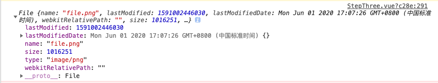

# JS 部分常用代码

## 深拷贝
传入赋值
~~~js
const serachParams = this.deepClone(this.serachParams);
~~~
调用方法
~~~js
deepClone(obj) {
  const objClone = Array.isArray(obj) ? [] : {};
  if (obj && typeof obj === 'object') {
    for (const key in obj) {
      if (obj.hasOwnProperty(key)) {
        // 判断ojb子元素是否为对象，如果是，递归复制
        if (obj[key] && typeof obj[key] === 'object') {
          objClone[key] = this.deepClone(obj[key]);
        } else {
          // 如果不是，简单复制
          objClone[key] = obj[key];
        }
      }
    }
  }
  return objClone;
},
~~~

## 删除对象中空的键值对
传入赋值
~~~js
otherParams = this.deleteEmptyObjChild(otherParams)
~~~
调用方法
~~~js
deleteEmptyObjChild(obj) {
  for (const key in obj) {
    if (!obj[key]) {
      delete obj[key];
    }
  }
  return obj;
},
~~~

## 判断IE浏览器
- 第一种
```js
  var userAgent = navigator.userAgent;  // 取得浏览器的 userAgent 字符串
  if(userAgent.indexOf("compatible") > -1 && userAgent.indexOf("MSIE") > -1 && !userAgent.indexOf("Opera") > -1) {
    alert("IE");
    // do sth
  }
```

- 第二种
```js
var ie = (navigator.appVersion.indexOf("MSIE") != -1);  // IE
if(ie) {
  alert("IE");
  // do sth
}
```

- 第三种
```js
  if (!!window.ActiveXObject || "ActiveXObject" in window) {
    alert("IE");
    // do sth
  }
```

## 快速排序
- （1）阮老师版（递归方法消耗太多内存）

```js
  quickSort(arr) {    
    if(arr.length <= 1) {        
      return arr;
    }    
    let pivotIndex = Math.floor(arr.length / 2);    
    let pivot = arr.splice(pivotIndex, 1)[0];
    let left = [];    
    let right = [];    
    for(let i = 0; i < arr.length; i++) {        
      if(arr[i] < pivot) {
          left.push(arr[i]);
      } else {
            right.push(arr[i]);
        }
    }    
    return quickSort(left).concat(pivot, quickSort(right));
  },
```
- (2) 按照维基百科中的原地(in-place)分区版本，实现快速排序方法如下：

```js
  quickSort11(arr) {   
    // 数组分区，左小右大
    this.sort(arr, 0, arr.length - 1); 
    return arr;
  },
  sort(arr, left, right) {        
    if(left > right) {            
      return;
    }        
    let storeIndex = this.partition(arr, left, right);
    this.sort(arr, left, storeIndex - 1);
    this.sort(arr, storeIndex + 1, right);
  },
  partition(arr, left, right) {        
    let storeIndex = left;        
    let pivot = arr[right]; // 直接选最右边的元素为基准元素
    for(let i = left; i < right; i++) {            
      if(arr[i] < pivot) {
        this.swap(arr, storeIndex, i);
        storeIndex++; // 交换位置后，storeIndex 自增 1，代表下一个可能要交换的位置
      } 
    }
    this.swap(arr, storeIndex, right); // 将基准元素放置到最后的正确位置上
    return storeIndex;
  },
  swap(arr, i, k) {        
    let temp = arr[i];
    arr[i] = arr[k];
    arr[k] = temp;
  },
```

## vue2.0路由切换后页面滚动位置不变BUG

最近项目中遇到这样一个问题，vue切换路由，页面到顶端的滚动距离仍会保持不变。

```js
  <a href="javascript:;" class="btn btn01" @click="useRightNow">立即试用</a>
  <router-link class="db" to="/user">个人中心</router-link>

  useRightNow(){
  if(判断用户存在){
        this.$router.push('/user')
    }else{
        this.$router.push("/login")
    }
  }
```
解决办法很简单，如下，直接监测watch路由变化，然后将body的滚动距离scrollTop赋值为0。

```js
  watch:{
    '$route':function(to,from){
      document.body.scrollTop = '0';    //这句比较重要（微信端可以这么写）
      document.documentElement.scrollTop = 0; //pc端这么写
    }
  }
```

## 监听微信浏览器回退键事件
```js
  // 回退事件
  watchBack(){
    window.addEventListener("popstate",(e)=>{
        this.$store.state.isGuide = false;
    },false)
  },
```

```js
  // 比较粗暴的禁止回退的方法
  // 这页面中引入这段JS后，一切后退事件都会失效，包括APP顶部自带的那个后退按钮，因此需要慎用。
  watchBack(){
    history.pushState(null, null, document.URL);
    window.addEventListener("popstate",(e)=>{
        history.pushState(null, null, document.URL);
    },false)
  },
```

## 时间 过滤器

```html
  <span class="floatRight time">{{selectData.createTime | timeData}}</span>
```
```js
filters: {    
  timeData:function(val){         //时间过滤器
      var d = new Date(val);
      var year = d.getFullYear();
      var month = d.getMonth() < 9 ? '0' + (d.getMonth() + 1): '' + d.getMonth();
      var day = d.getDate() <10 ? '0' + d.getDate() : '' + d.getDate();
      var hour = d.getHours() <10 ? '0' + d.getHours() : '' + d.getHours();
      var minutes = d.getMinutes() <10 ? '0' + d.getMinutes() : '' + d.getMinutes();
      return  year+ '-' + month + '-' + day + ' ' + hour + ':' + minutes;
  }
},
```

## 移动端 （出现蒙层屏幕不可滑动）
```js
  stop(){
    // 禁止页面滑动
    document.addEventListener("touchmove",function(event){
        event.preventDefault()
    },{passive:false})
  },
  move(){
    // 恢复页面滑动
    document.addEventListener('touchmove', function (event) {
      window.event.returnValue = true;
    }, false);
  },
  // 以上方法不兼容苹果A12处理器，改进方法如下

  // 取消手机屏幕滑动默认事件  (全局封装后在组件内调用)
  Vue.prototype.defaultScroll = function(event) {
    event.preventDefault()
  }
  // 屏幕停止
  stop(){
    document.addEventListener("touchmove",this.defaultScroll,{passive:false})// 禁止页面滑动
  },
  move(){                                       
    document.removeEventListener('touchmove',this.defaultScroll,false); // 屏幕移动
  },
```

## base64转换成可用formdata提交的文件

```js
// 调用
let newFile = this.convertBase64UrlToBlob(imgUrl); // 生成不预览

// 方法
/*将base64转换成可用formdata提交的文件,urlData base64的url */
convertBase64UrlToBlob(dataurl, filename = 'file'){
  let arr = dataurl.split(',')
  let mime = arr[0].match(/:(.*?);/)[1]
  let suffix = mime.split('/')[1]
  let bstr = atob(arr[1])
  let n = bstr.length
  let u8arr = new Uint8Array(n)
  while (n--) {
    u8arr[n] = bstr.charCodeAt(n)
  }
  return new File([u8arr], `${filename}.${suffix}`, {
    type: mime
  })
},
```
打印newFile得到




## 预加载图片

预加载单个图片 val为图片地址
```js
preloadImg(val) {
  let imagePic = new Image();
  imagePic.src = val;
  let timers = setInterval(() => {
    if (imagePic.complete) {
      // to do sth
      clearInterval(timers);
    }
  }, 50);
},
```

预加载图片数组
```js
imgSrc: [
  'static/homepage/map/s1bg.jpg',
  'static/homepage/map/s1Blur.jpg',
  'static/courseList/imgs/returnMapHover.png',
  'static/courseList/imgs/returnCourseHover.png',
], // 地图背景

this.preloadImg(this.imgSrc);
preloadImg(arr) {
  for (let i = 0; i < arr.length; i++) { // 预加载
    this.imgWrap[i] = new Image();
    this.imgWrap[i].src = arr[i];
  }
  var timers = setInterval(() => {
    if (this.imgWrap[arr.length - 1].complete) {
      // to do sth
      clearInterval(timers);
    }
  }, 50);
},
```

加载图片，含回调函数
```js
getImageInfo(url, callback) {
  var img = new Image();
  img.src = url;
  if (img.complete) {
      callback(img.width, img.height); // 如果图片被缓存，则直接返回缓存数据
  } else {
      img.onload = function () {
          callback(img.width, img.height);
      }
  }
}，
```


## 截取url参数
```js
// 截取url参数
sliceUrl() {
  // 需要解码后台传来的中文参数时 放开
  const url = decodeURI(decodeURI(document.location.href));
  const urlStr = {};
  const urlAry = [];
  if (url.indexOf('?') != -1) {
    const str = url.substr(1);
    const strs = str.split('&');
    for (let i = 0; i < strs.length; i++) {
      urlStr[strs[i].split('=')[0]] = unescape(strs[i].split('=')[1]);
      // 多个参数时放开
      urlAry.push(unescape(strs[i].split("=")[1]))
    }
  }
  return urlAry;
},
```

## 区分input框中英文（中文2字符，英文1字符）
```js
export function validTxtLength(input) {
  var i;
  var sum;   
  sum = 0;   
  for (i = 0; i < input.length; i++) {   
    //中英文不同的长度检测办法，英文一个字符长度，中文两个支付长度
    if ((input.charCodeAt(i) >= 0) && (input.charCodeAt(i) <= 255)) {   
      sum += 1;   
    } else {   
      sum += 2;   
    }   
  }
  return sum; 
}
```

## 转译特殊字符

```js
function validSpeVal(val) {
  return val.replace(/&/g, '&amp;').replace(/</g, '&lt;').replace(/>/g, '&gt;').replace(/"/g, '&quot;')
  .replace(/'/g, "&apos;").replace(/ /g, "&nbsp;");
}
```
