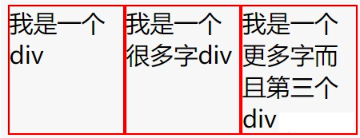
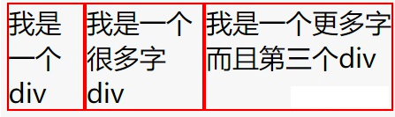

# css部分

## 1.css文字少时居中，多时左对齐

```css
.box{
    width: 200px;
    height: 100px;
    text-align: center;
    background: red;
}
.content{
    display: inline-block;
    color: white;
    text-align: left;
}
```

```html
<div class="box">
    <div class="content">测试测试测试测试测试测试测试测试</div>
</div>
```

## 2.flex:1

flex: flex-grow flex-shrink flex-basis;<br>
第一个参数表示: flex-grow 定义项目的放大比例，默认为0，即如果存在剩余空间，也不放大<br>
第二个参数表示: flex-shrink 定义了项目的缩小比例，默认为1，即如果空间不足，该项目将缩小<br>
第三个参数表示: flex-basis给上面两个属性分配多余空间之前, 计算项目是否有多余空间, 默认值为 auto, 即元素本身的大小（auto 为表示项目本身的大小, 如果设置为 auto, 那么这三个盒子就会按照<b>自己内容的多少来等比例的放大和缩小</b>）<br>


<b>flex: 1;</b><br>
<br>

<b>flex: 1 1 auto;</b><br>
<br>

