## 安装&配置

- 通过npm或cnpm安装

```js
npm install view-design --save 
```
- 在 webpack 入口页面 main.js 中如下配置：

```js
import Vue from 'vue';
import App from 'components/app.vue';
import ViewUI from 'view-design';
import 'view-design/dist/styles/iview.css';

Vue.use(ViewUI);

new Vue({
    el: '#app',
    render: h => h(App)
});

```

## Icon 图标(自定义图标)

- 1.首先去阿里巴巴矢量图标库下载心仪图标

网址：https://www.iconfont.cn/<br />

- 2.找到喜欢的图标,加入购物车

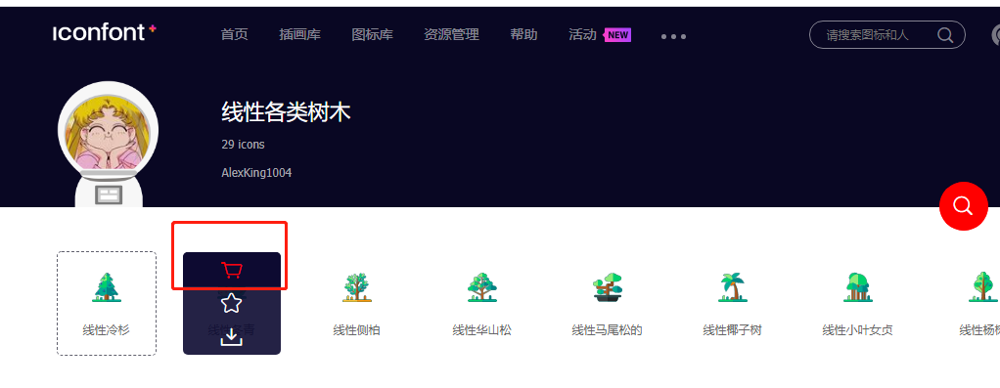

- 3.点击右上角购物车

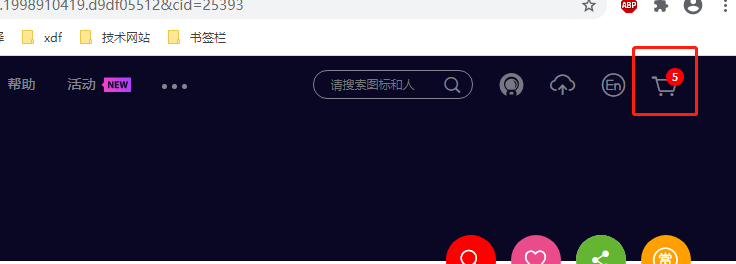

- 4.确认加入购物车的图片，然后选择添加至项目

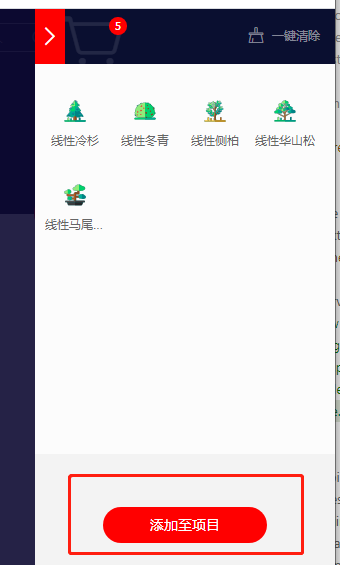

- 5.点击下发小加号，新建一个项目，给项目起名字。

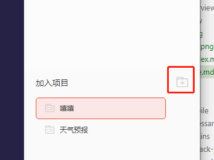

- 6.看图步骤1 ，我选的是font-class，之后点击下载至本地

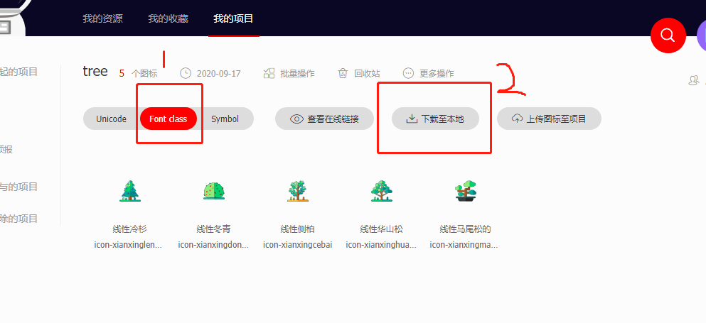

- 7.解压后，你会看到这样一个目录结构

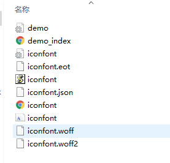

- 8.这是回到你的vue项目，你可以在根目录下找一找有没有static文件夹，如果没有自行创建。

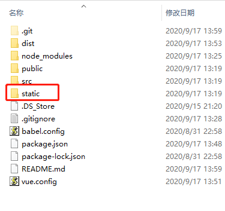

- 9.进入static文件夹，创建一个iconfont文件

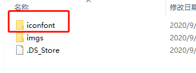

- 10.此时把刚才解压出来的文件夹里面的内容 全部复制到项目的iconfont中

- 11.回到项目中，打开项目的main.js,把iconfont的css引进去

```js
import '../static/iconfont/iconfont.css'
```
示例：<br />
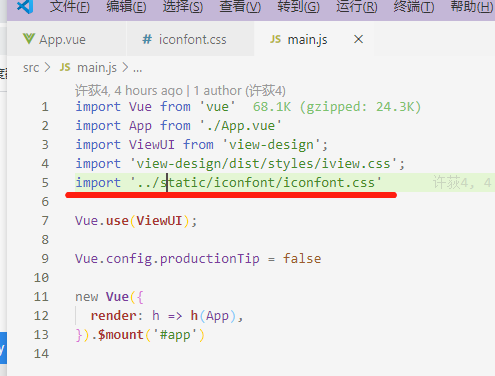

- 12.打开引得资源中的iconfont.css ，修改其中的类名，不要和iviewui的重复。它叫iconfont，我们可以叫i_confont

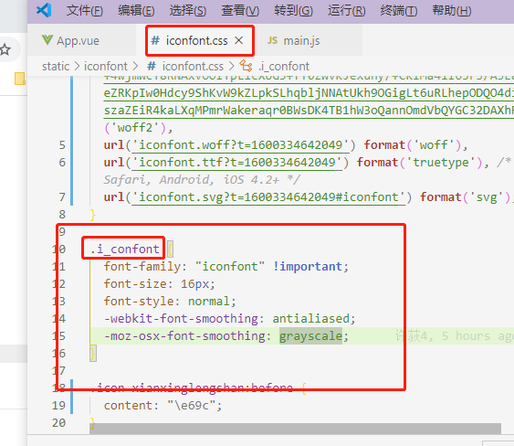

- 13.在需要使用的地方写代码

```js
<Icon custom="i_confont icon-xianxingcebai" size="24" />
```
注意：官网提示 custom属性专门是用来自定义的，所以就不要用type啦。<br >

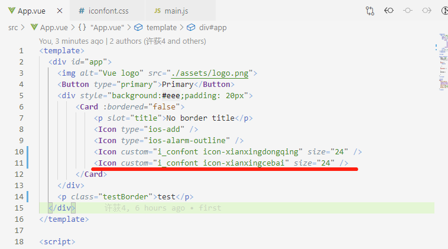

- 14.到这里就大功告成了~

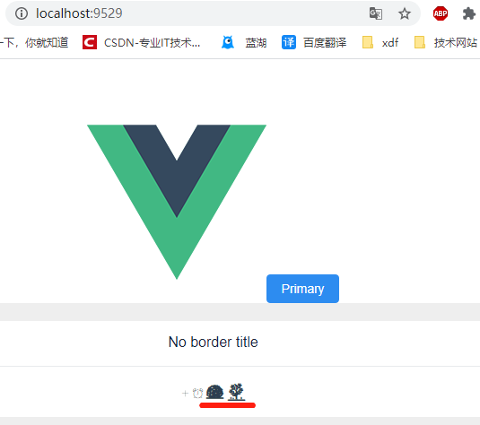

- 温馨提示：你想看的图片的类名记得在资源文件里面找，就是那个iconfont文件夹中

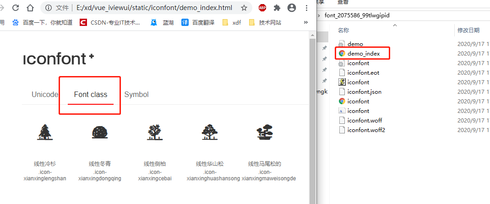

这里也有其他的引用方式就不一一介绍了~


