通过coding.net发布静态网站，适合做一些博客之类的，不需要存储数据什么的 最好。<br />
在这里我传一个通过vue搭建的项目，发布静态网站的前提是，你有coding.net的账号 且 有属于自己的个人域名。<br >
我这里是在阿里云上买了一个域名，不光要买域名，还要完成里面的配置，这个过程，当时是找的宝哥帮我弄得，<br >
所以，没有细节图片, 可以自行百度解决<br>

那么在这两个 条件都具备的情况下，我们开始通过coding.net发布静态网站。<br >

1.首先在coding建一个代码库，并将代码推送到这个代码库。之后打开左下方的设置<br>
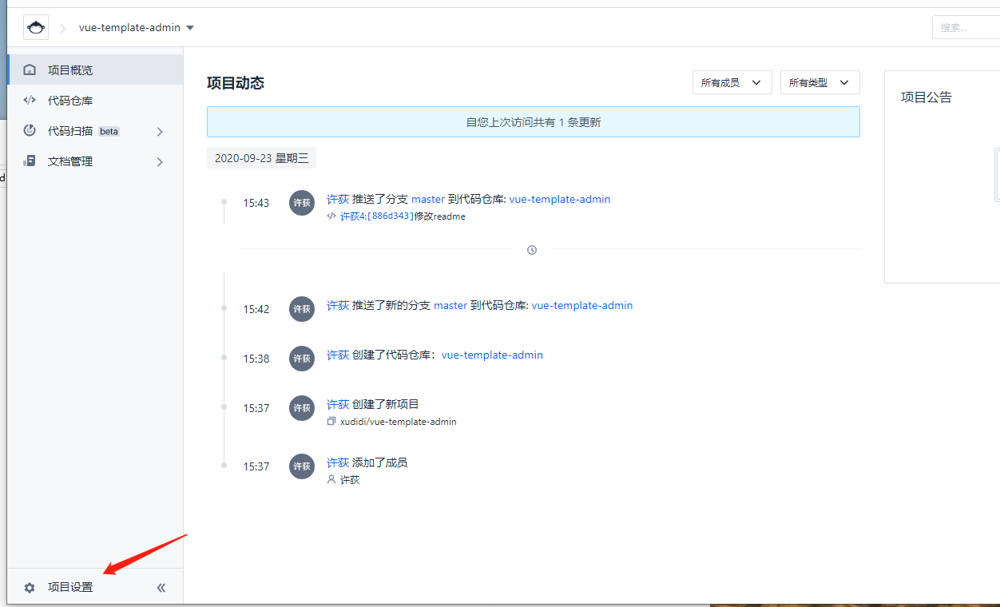

2.点击项目设置->功能开关->持续部署 打开<br>
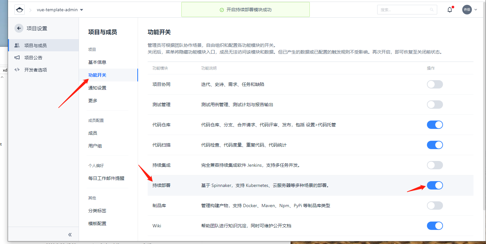

3.持续部署打开后，点击左上方 ，项目设置 回到上一页<br>
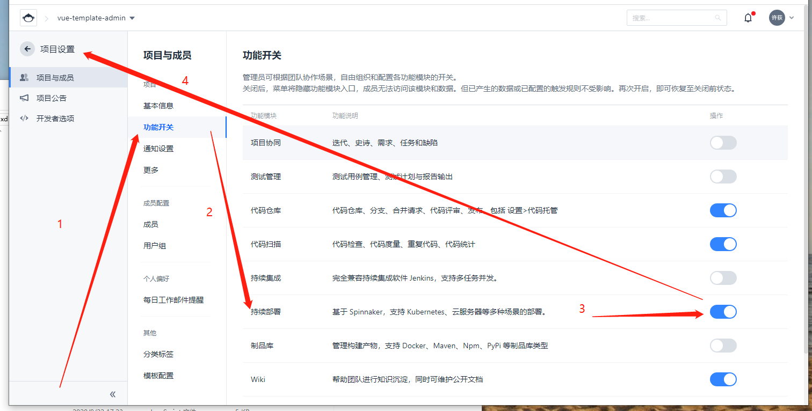

4.此时可以看到持续部署这个选项出来了，点击静态网站，再点击立即发布静态网站。<br>
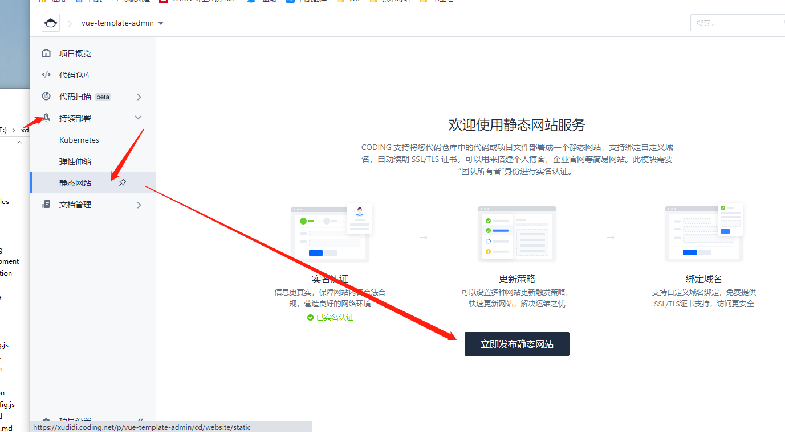

5.填写一些基本信息，点击保存。<br>
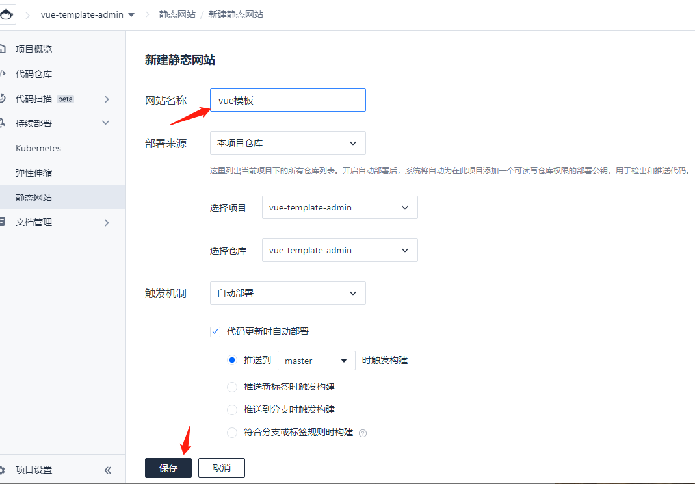

6.会生成一个访问地址，这个页面先保留，我们可以把它替换成自己的域名来访问。<br>
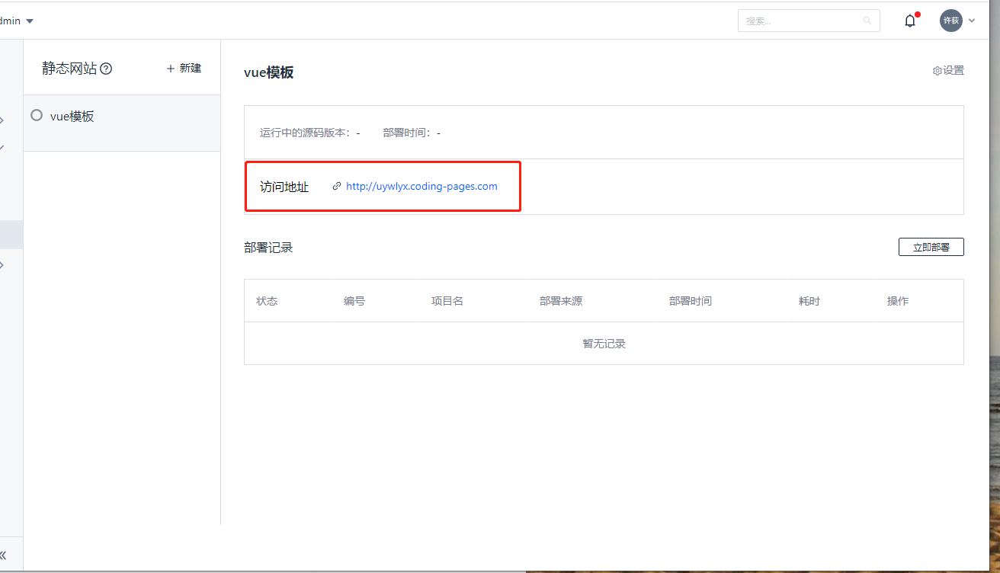

7.此时，以阿里云为例，打开阿里云，点击域名<br>
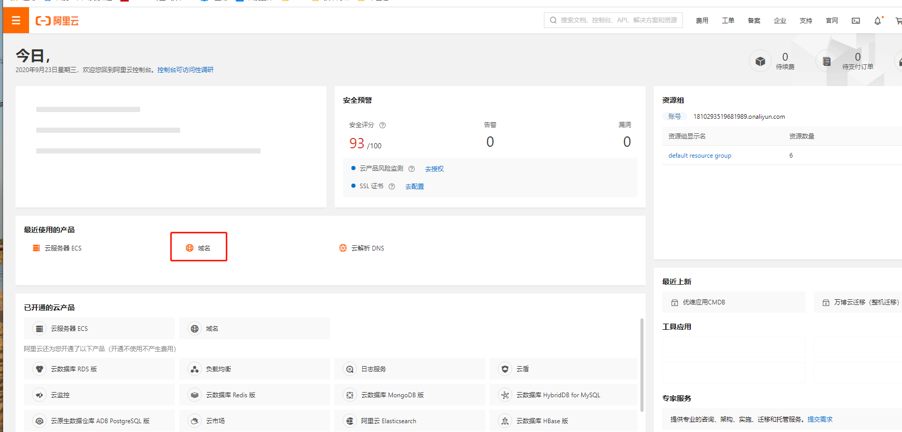

8.进入域名专属页面后，点击进入域名解析列表。<br>
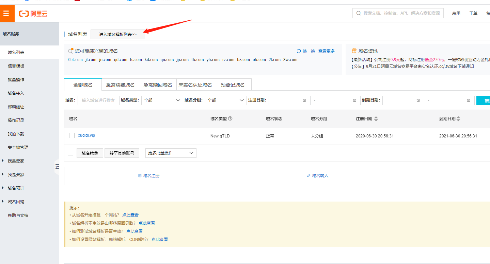

9.点击添加记录<br>
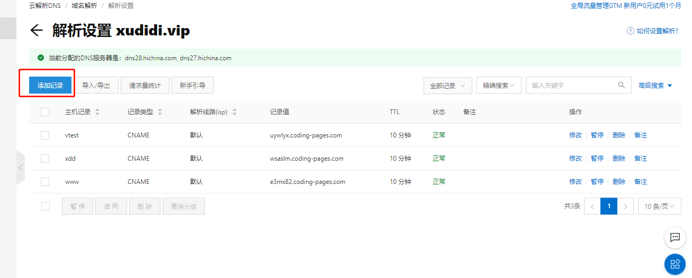

10.出现这个页面，填写基本内容<br>

示例：<br>

记录类型：CNAME

主机记录：xdd（可以随便设置）

解析线路：默认

记录值：coding中随机生成的地址

TTL：默认10分钟

10.完成上述操作后,保存，进入到conding静态网站 -> 点击右上角设置，找到自定义域名：<br />
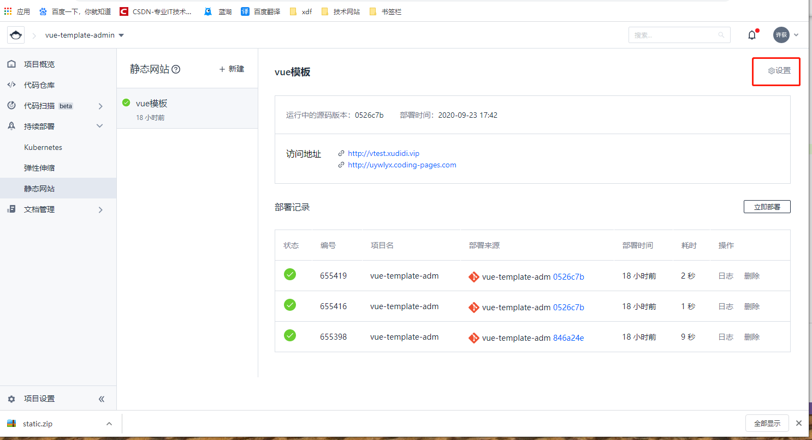

11.在这里填写 刚刚写好的二级 + 域名 <br>
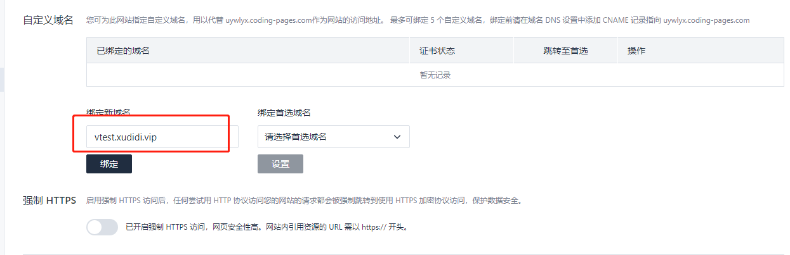

12.点击确定，审核完毕即可访问根目录下的index

13.当然 这是一个静态页面，html形式的。如果你是vue项目，你需要 先在本地执行npm run build，在本地打包。<br>
打包之后，在根目录的.gitignore文件中，把 dist文件去掉（也就是打包后生成的文件，具体名字具体分析）<br>
去掉之后，保存 ，此时再推一次代码。将代码push到远程分支上。<br>
这样上传上去之后，输入你的完整地址 外加一个/生成文件地址 即可。<br>
例如我的 http://vtest.xudidi.vip/dist/ ，由于项目引用的资源路径不对，所以 还需要排查原因。<br>
附上一个基础配置文件：<br>
在根目录下创建一个vue.config.js文件<br>

```js
const webpack = require('webpack');

module.exports = {
  publicPath: './',
  outputDir: 'dist',
  assetsDir: 'static',
  lintOnSave: true,
  productionSourceMap: false,
  devServer: {
    port: 9529,
    open: true,
    overlay: {
      warnings: false,
      errors: true,
    },
  },
}
```

已有的 可以再控制台查看，如果控制台报错，显示资源有问题，还需要在配置<br>