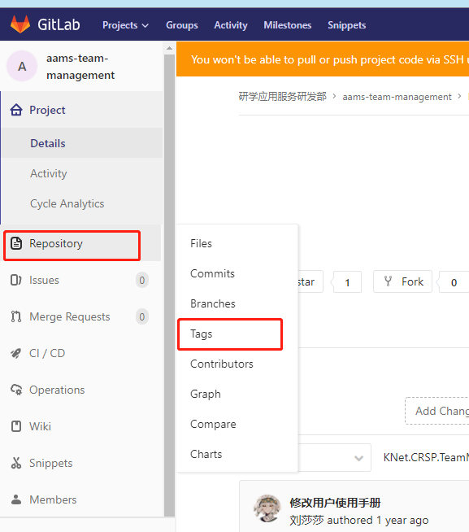

# 背景

像其他版本控制系统（VCS）一样，Git 可以给仓库历史中的某一个提交打上标签，以示重要。 比较有代表性的是人们会使用这个功能来标记发布结点（ v1.0 、 v2.0 等等</br>
可以在本地操作然后push到远程代码库，也可以直接在代码库管理页面中操作。


# 操作

## 代码库页面
- 新建标签



- 输入标签内容


- 对比左右不分，是编辑后生成的 样式
可以在release中加入详细内容


- 有权限时，可操作删除标签

> 没有权限的话就联系管理员吧</br>


## 本地操作

```js
// 新增本地  git tag v20220222 37f2370f6c3084fc40a562361dae6edb5746c188
git tag [tag名] [版本号]

// 推远程  git push origin v20220222
git push origin [tag名]

// 删除本地 git tag -d v20220222
git tag -d [tag名]

```

## 切换至某tag继续开发(代码)<br>

你会想执行git checkout tag_name <br>
但是，这时候 git 可能会提示你当前处于一个“detached HEAD" 状态。
因为 tag 相当于是一个快照，是不能更改它的代码的。
如果要在 tag 代码的基础上做修改，你需要一个分支：

```js
git checkout -b branch_name tag_name
```

这种本地创建分支，最后修改完记得push到远程代码仓库

## 切换至某tag继续开发(页面操作)
- 新建分支


- 新建时选择对应的来源


刚刚创建的tag会出现在这个下拉框中，选择好基于这个tag创建新分支就可以继续操作了。