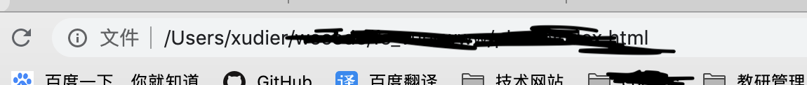
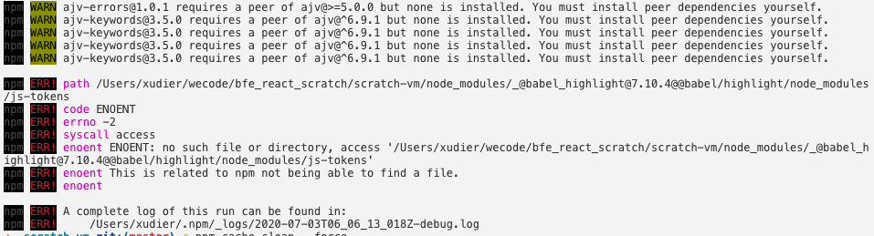

## 1.cookie的域

> 目的：需要两个不同的域 共享cookie。（xdd.qwer.vip 和 ugg.xdd.qwer.vip 类似这样的）<br>
> 背景：我在 xdd.qwer.vip 这个域下，获取并设置token，通过 location.href 跳转到 ugg.xdd.qwer.vip <br>
> 发现 在之前域下设置的cookie竟然死活都获取不到， 通过搜索 发现问题是：<br>

cookie的域是用来限制哪些域名能来访问cookie的, 解决同一个主域下的访问问题<br>

项目中我设置cookie的方式是，通过 ‘js-cookie插件’ 实现的。<br>

安装：
```js
npm install js-cookie --save
```

引用：
```js
import Cookies from 'js-cookie'
```

### 一般用法：

- 设置：
```js
// Create a cookie, valid across the entire site:
Cookies.set('name', 'value');

// Create a cookie that expires 7 days from now, valid across the entire site:
Cookies.set('name', 'value', { expires: 7 });

// Create an expiring cookie, valid to the path of the current page:
Cookies.set('name', 'value', { expires: 7, path: '' }); 
```

- 获取：
```js
// Read cookie:
Cookies.get('name'); // => 'value'
Cookies.get('nothing'); // => undefined

// Read all visible cookies:
Cookies.get(); // => { name: 'value' }
```

- 删除：

```js
// Delete cookie:
Cookies.remove('name');

// Delete a cookie valid to the path of the current page:
Cookies.set('name', 'value', { path: '' });
Cookies.remove('name'); // fail!
Cookies.remove('name', { path: '' }); // removed!
```

### 特殊用法：
跟一般使用不同的是，从Cookie中取出的时候，要从字符串转换成json格式：
```js
const user = {
  name: 'lia',
  age: 18
}
Cookies.set('user', user)
const liaUser = JSON.parse(Cookies.get('user'))
```

在项目中我使用的设置及删除方法是：
```js
Cookies.set( name, value);  // name 及 value均为动态
Cookies.remove('name'); 
```
> 发现不同域不能共享cookie的时候，做出以下修改

```js
  return Cookies.set(key, value, { domain: 'qwer.vip' });
  return Cookies.remove(key, { path: '', domain: 'qwer.vip' });
```

## 2.本地写入cookie，chrom调试无反应

> 今天在项目中写入cookie时，一直没反应.原生js和插件都尝试了，可还是没有反应
> 结果发现！！！ ，不要直接是file://这种格式的打开文件

<br>

这种就是不对的，将文件放到服务器上运行！<br>
当然还有另一种方法，本地的话chrome不行，用其他浏览器调试吧。我用了火狐，一切ok，最后推测，chorm也ok。


## 3.npm安装模块遇到ENOENT: no such file or directory, rename错误

- 在做scratch 3.0二次开发，在scratch-vm文件夹下进行npm link 的环节中，一直在报这个错误
- 找了很多地方，感觉这个是最靠谱的，
- 删除了项目中的package-lock.json 之后就真的没有报过了，

+ [原文地址](https://blog.csdn.net/u012878073/article/details/86511957)

## 4.npm安装模块遇到ENOENT: no such file or directory, access错误
<br>
```js
path /Users/xudier/wecode/bfe_react_scratch/scratch-vm/node_modules/_@babel_highlight@7.10.4@@babel/highlight/node_modules/js-tokens
npm ERR! code ENOENT
npm ERR! errno -2
npm ERR! syscall access
npm ERR! enoent ENOENT: no such file or directory, access '/Users/xudier/wecode/bfe_react_scratch/scratch-vm/node_modules/_@babel_highlight@7.10.4@@babel/highlight/node_modules/js-tokens'
npm ERR! enoent This is related to npm not being able to find a file.
npm ERR! enoent 

npm ERR! A complete log of this run can be found in:
npm ERR!     /Users/xudier/.npm/_logs/2020-07-03T06_16_23_041Z-debug.log
```

- 大部分类似与这种的问题，我们可以首先找到关键字，看看他是node_modules下面的哪个包找不到
- 代码中所示js-tokens，是这个，于是乎我们可以来到这个网站

+ [npm](https://www.npmjs.com/)<br>

- 找到后通过命令下载，我一般会用cnpm，npm经常会报错。
- 再重新执行那个会报错的命令，可以看看问题有没有解决

## 5.vue在生产环境清除console.log

在cli还是2.xx 版本的时候，我们可以这样
- 1.npm/cnpm 下载
```js
 cnpm uglifyjs-webpack-plugin --save-dev
```

- 2.在build/webpack.prod.conf.js文件下,在webpackConfig中plugins数组中进行配置

```js
plugins: [
  new UglifyJsPlugin({
    uglifyOptions: {
      compress: {
        warnings: false,
        drop_console: true,
        pure_funcs: ['console.log']
      },
      mangle: {
        safari10: true
      }
    },
    sourceMap: config.build.productionSourceMap,
    parallel: true
  }),
]
```

如果cli是3.xx几版本的，可以尝试这个
+ [原文地址](https://blog.csdn.net/benben513624/article/details/86661235?utm_medium=distribute.pc_relevant.none-task-blog-BlogCommendFromMachineLearnPai2-2.compare&depth_1-utm_source=distribute.pc_relevant.none-task-blog-BlogCommendFromMachineLearnPai2-2.compare)

## 6.系统可能不会保存你所做的修改 onbeforeunload

```js
// 监听页面关闭
window.addEventListener('beforeunload', (e) => {
    let changeSymbol = false
    if(changeSymbol) {
      return (e.returnValue = '有信息未保存，确认离开？！'); 
    }
    // return null; // 不会弹框
    // return true // 会弹框
})
```

像上述情况，只要将changeSymbol改为true，那么return的内容必为true，也就会弹框。