目的：使用Pdf.js预览pdf并隐藏下载，打印，注视ctrl+s下载功能，及设置默认页面显示内容尺寸。
+ [现成demo](https://github.com/570805869/pdfJs)  
+ [Pdf.js官网](https://mozilla.github.io/pdf.js/getting_started/#download)  

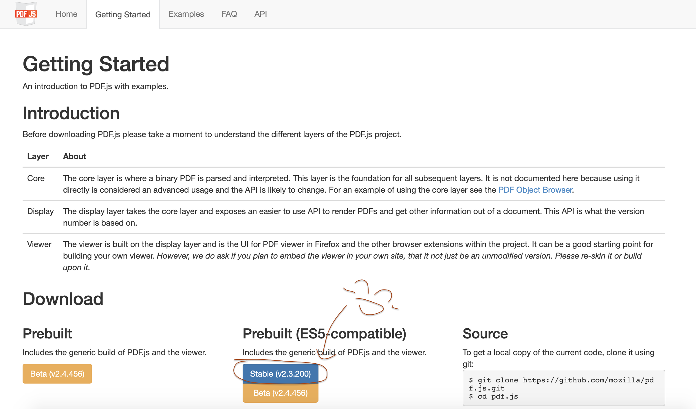 

- 做的时候，遇到一个问题，直接用了/static/pdf/web/viewer.html?file= 这个路径的时候页面一直再报错， 
报错内容为： Uncaught SyntaxError: Unexpected token < 
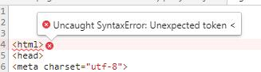 
类似这样的，针对于我的问题来说，就是 我pdf这个文件放的位置不对。 

- 项目当时用的是webpack 3.0搭建的，在根目录下面没有static文件，只有public文件， 
报错时，我是在根目录上直接新建了一个static文件，但是这样是不对的 

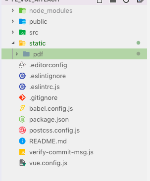 

- 后来，尝试在public文件中新建了一个static文件，再把pdf文件放入其中，才好。

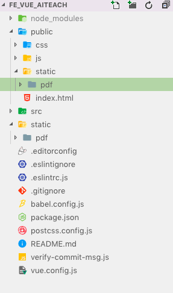 

### 隐藏下载功能

- 找到‘/static/pdf/web/viewer.html’ 中的按钮设置style="display:none"
值得注意的是页面中大概有两个按钮，都表示 打印和下载 按钮，我改的大概是190行左右，达到目的，截图为110行，仅供参考。

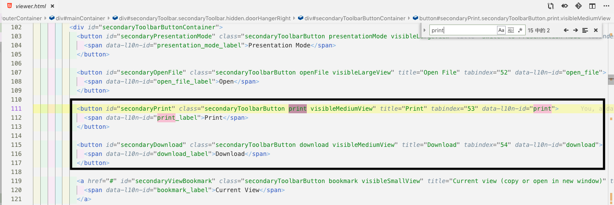 

- 找到‘/static/pdf/web/viewer.js 注释打印 和 下载的事件"
我在大概1745行找到

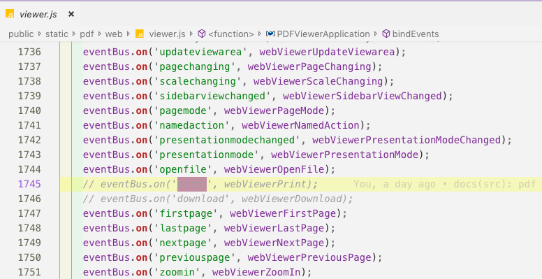 

-  找到‘/static/pdf/web/viewer.js 注释快捷键ctrl+s 下载事件"
我大概在2375行找到

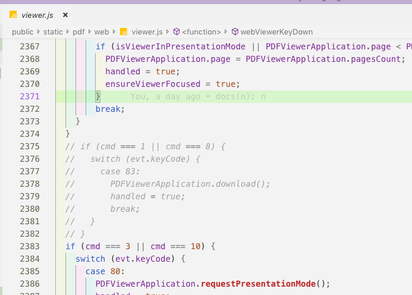 

这样大功告成

### 设置默认显示宽度：适合页宽

- 默认第一次用户进入是 自动缩放，而需求是第一次进入时默认为 适合页宽

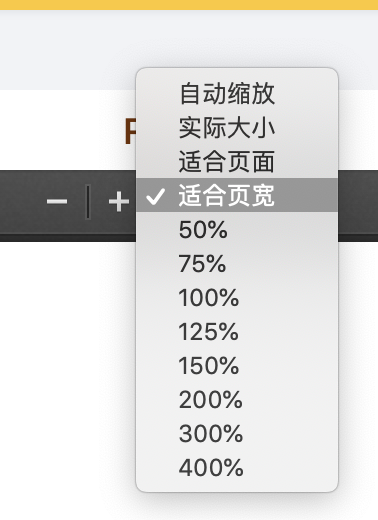 

效果展示： 

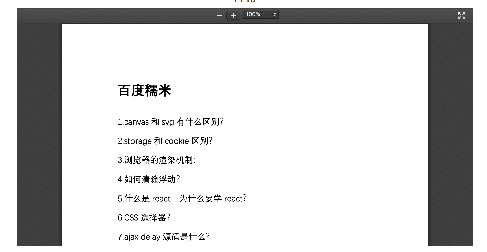 自动缩放
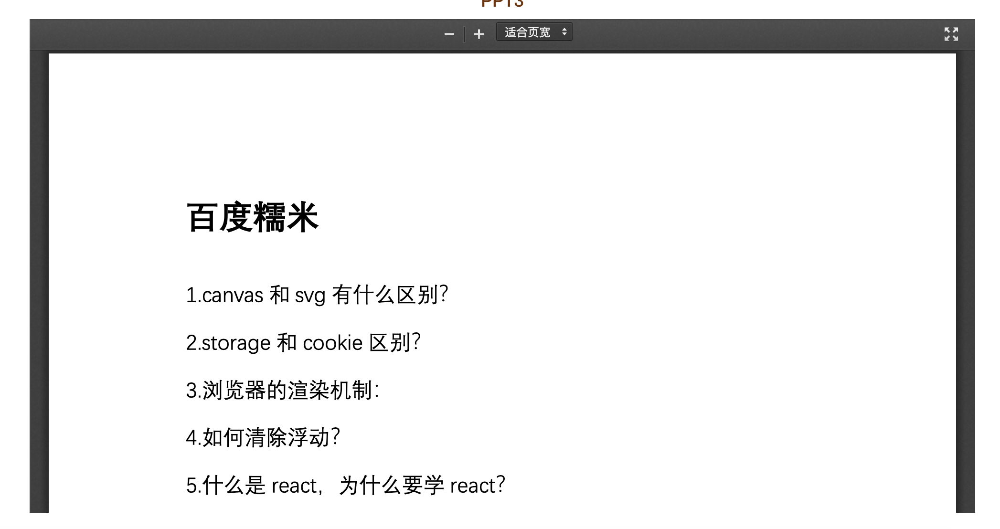 适合页宽 
也就是白色的部分大了很多,修改如下 

- 首先在viewer.html 中找到 id = scaleSelectContainer,设置他的selected

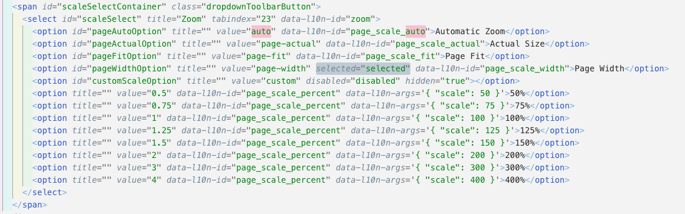Page Width 

- 在viewer.js 中找到 DEFAULT_SCALE_VALUE 设置为Page Width

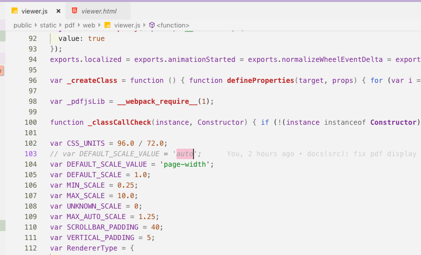Page Width 

这个pdf.js非常具有人性化的功能，它能够记住用户的行为习惯，存储在localStorage中，同一个项目引了两个也不怕，
就很神奇，很nice！
记录完毕
