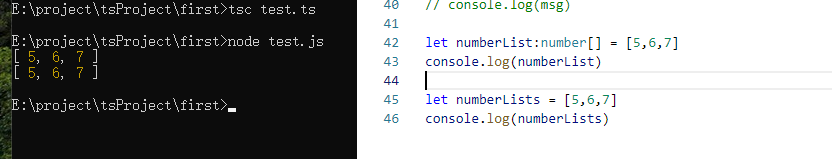

## 数组

我们也可以使用 Array 对象创建数组。<br>
Array 对象的构造函数接受以下两种值：<br>
- 表示数组大小的数值。
- 初始化的数组列表，元素使用逗号分隔值。

```ts
// 指定数组初始化大小：
var arr_names:number[] = new Array(4)  
 
for(var i = 0; i<arr_names.length; i++) { 
        arr_names[i] = i * 2 
        console.log(arr_names[i]) 
}

// 输出结果为：
0
2
4
6
```
以下实例我们直接初始化数组元素：

```ts
var sites:string[] = new Array("Google","Runoob","Taobao","Facebook") 
 
for(var i = 0;i<sites.length;i++) { 
        console.log(sites[i]) 
}

// 输出结果为：
Google
Runoob
Taobao
Facebook
```

### 数组泛型
我们也可以使用数组泛型（Array Generic） 
```
Array<elemType>
```
 来表示数组：

```ts
let fibonacci: Array<number> = [1, 1, 2, 3, 5];
```

### 用接口表示数组
```ts
interface NumberArray {
    [index: number]: number;
}
let fibonacci: NumberArray = [1, 1, 2, 3, 5];
```
**NumberArray** 表示：只要索引的类型是数字时，那么值的类型必须是数字。
虽然接口也可以用来描述数组，但是我们一般不会这么做，因为这种方式比前两种方式复杂多了。

### any 在数组中的应用
```ts
// 一个比较常见的做法是，用 any 表示数组中允许出现任意类型：
let list: any[] = ['xcatliu', 25, { website: 'http://xcatliu.com' }];
```
