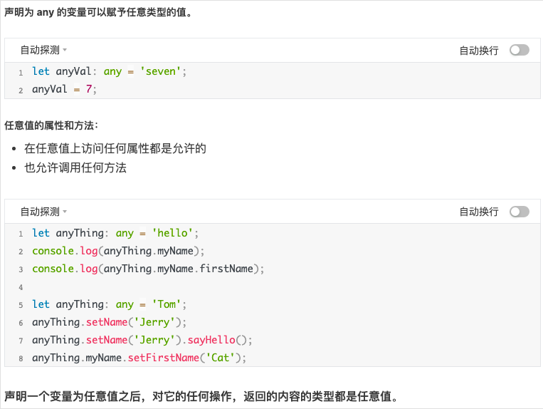
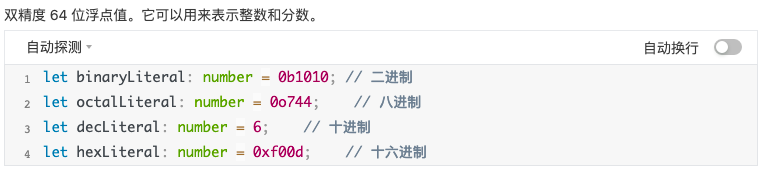
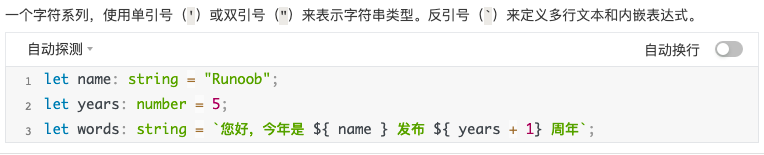
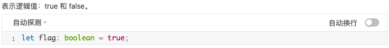
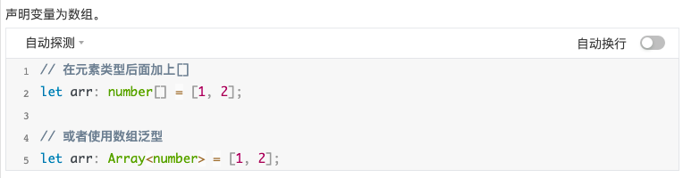
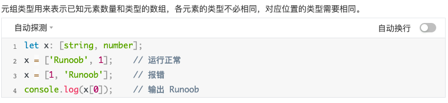
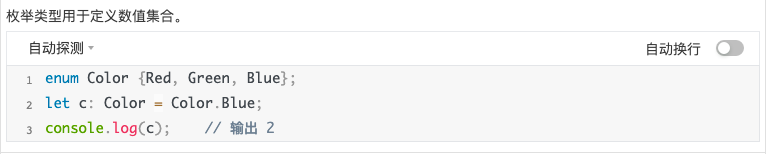
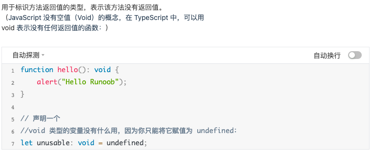
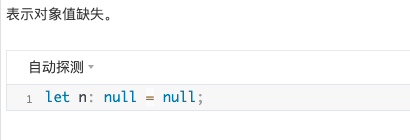
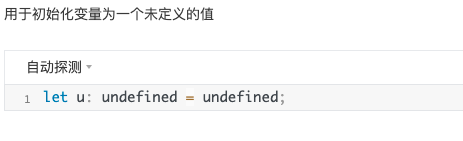

## 基础类型


| 数据类型 | 关键字 | 描述 |
| --- | --- | --- |
| 任意类型 | any |   |
| 数字类型 | number |  |
| 字符串类型 | string |  |
| 布尔类型 | boolean |  |
| 数组类型 | 无 |  |
| 元组 | 无 |  |
| 枚举 | enum |  |
| void | void |  |
| null | null |  |
| undefined | undefined |  |
| never | never | never 是其它类型（包括 null 和 undefined）的子类型，代表从不会出现的值。 |

## 变量声明

变量是一种使用方便的占位符，用于引用计算机内存地址。我们可以把变量看做存储数据的容器。

命名规则：
- 变量名称可以包含数字和字母。
- 除了下划线 _ 和美元 $ 符号外，不能包含其他特殊字符，包括空格。
- 变量名不能以数字开头。

```ts
// 声明变量的类型及初始值：  var [变量名] : [类型] = 值;
var uname:string = "Runoob";

// 声明变量的类型，但没有初始值，变量值会设置为 undefined： var [变量名] : [类型];
var uname:string;

// 声明变量并初始值，但不设置类型，该变量可以是任意类型： var [变量名] = 值;
var uname = "Runoob";

// 声明变量没有设置类型和初始值，类型可以是任意类型，默认初始值为 undefined：var [变量名];
var uname;

// TypeScript 遵循强类型，如果将不同的类型赋值给变量会编译错误，如下实例：
var num:number = "hello"     // 这个代码会编译错误

```