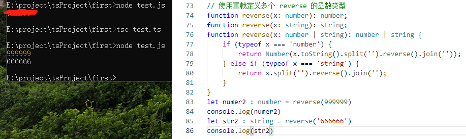

## 函数
函数就是包裹在花括号中的代码块，前面使用了关键词 function：<br>
- 函数声明（Function Declaration）
- 函数表达式（Function Expression）

语法格式如下所示：
```ts
// 函数声明（Function Declaration）
function sum(x, y) {
    return x + y;
}

// 函数表达式（Function Expression）
let mySum = function (x, y) {
    return x + y;
};
```

一个函数有输入和输出，要在 TypeScript 中对其进行约束，需要把输入和输出都考虑到，其中函数声明的类型定义较简单：
```ts
function sum(x: number, y: number): number {
    return x + y;
}
```

注意，输入多余的（或者少于要求的）参数，是不被允许的：
```ts
function sum(x: number, y: number): number {
    return x + y;
}
sum(1, 2, 3);

// index.ts(4,1): error TS2346: Supplied parameters do not match any signature of call target.
```

```ts
function sum(x: number, y: number): number {
    return x + y;
}
sum(1);

// index.ts(4,1): error TS2346: Supplied parameters do not match any signature of call target.
```

### 函数表达式
如果要我们现在写一个对函数表达式（Function Expression）的定义，可能会写成这样：
```ts
let mySum = function (x: number, y: number): number {
    return x + y;
};
```
这是可以通过编译的，不过事实上，上面的代码只对等号右侧的匿名函数进行了类型定义，<br>
而等号左边的 mySum，是通过赋值操作进行类型推论而推断出来的。如果需要我们手动给 mySum 添加类型，则应该是这样：
```ts
let mySum: (x: number, y: number) => number = function (x: number, y: number): number {
    return x + y;
};
```

注意不要混淆了 TypeScript 中的 => 和 ES6 中的 =>。
在 TypeScript 的类型定义中，<font color="green">=> 用来表示函数的定义，左边是输入类型，需要用括号括起来，右边是输出类型。</font>

### 函数返回值
> 有时，我们会希望函数将执行的结果返回到调用它的地方。通过使用 return 语句就可以实现。在使用 return 语句时，函数会停止执行，并返回指定的值。
```ts
function function_name():return_type { 
    // 语句
    return value; 
}
```
- return_type 是返回值的类型。
- return 关键词后跟着要返回的结果。
- 一般情况下，一个函数只有一个 return 语句。
- 返回值的类型需要与函数定义的返回类型(return_type)一致。

```ts
// 函数定义
function greet():string { // 返回一个字符串
    return "Hello World" 
} 
 
function caller() { 
    var msg = greet() // 调用 greet() 函数 
    console.log(msg) 
} 
 
// 调用函数
caller()
```
- 实例中定义了函数 greet()，返回值的类型为 string。
- greet() 函数通过 return 语句返回给调用它的地方，即变量 msg，之后输出该返回值。

### 创建方法
```ts
// 用接口定义函数的形状
interface SearchFunc {
    (source: string, subString: string): boolean;
}
let mySearch: SearchFunc;
mySearch = function(source: string, subString: string) {
    return source.search(subString) !== -1;
}
```

### 可选参数
**可选参数必须接在必需参数后面，可选参数后面不允许再出现必需参数**
```ts
// 用 ? 表示可选的参数
function buildName(firstName: string, lastName?: string) {
    if (lastName) {
        return firstName + ' ' + lastName;
    } else {
        return firstName;
    }
}
let tomcat = buildName('Tom', 'Cat');
let tom = buildName('Tom')
```

### 参数默认值
TypeScript 会将添加了默认值的参数识别为可选参数，**不受可选参数必须接在必需参数后面的限制**
```ts
function buildName(firstName: string = 'Tom', lastName: string) {
    return firstName + ' ' + lastName;
}
let tomcat = buildName('Tom', 'Cat');
let cat = buildName(undefined, 'Cat');
```

### 剩余参数
```ts
function push(array: any[], ...items: any[]) {
    items.forEach(function(item) {
        array.push(item);
    });
}
 
let a = [];
push(a, 1, 2, 3);
```
### 重载

**Java**中的方法重载，指的是两个或者两个以上同名的函数，但是它们的参数是不一样的，这时候就会出现函数重载；<br>
**typescript**中的重载，通过一个函数提供多个函数类型定义来实现重载；<br>
输入为数字的时候，输出也应该为数字，输入为字符串的时候，输出也应该为字符串。<br>

```ts
// 使用重载定义多个 reverse 的函数类型
function reverse(x: number): number;
function reverse(x: string): string;
function reverse(x: number | string): number | string {
    if (typeof x === 'number') {
        return Number(x.toString().split('').reverse().join(''));
    } else if (typeof x === 'string') {
        return x.split('').reverse().join('');
    }
}
```

