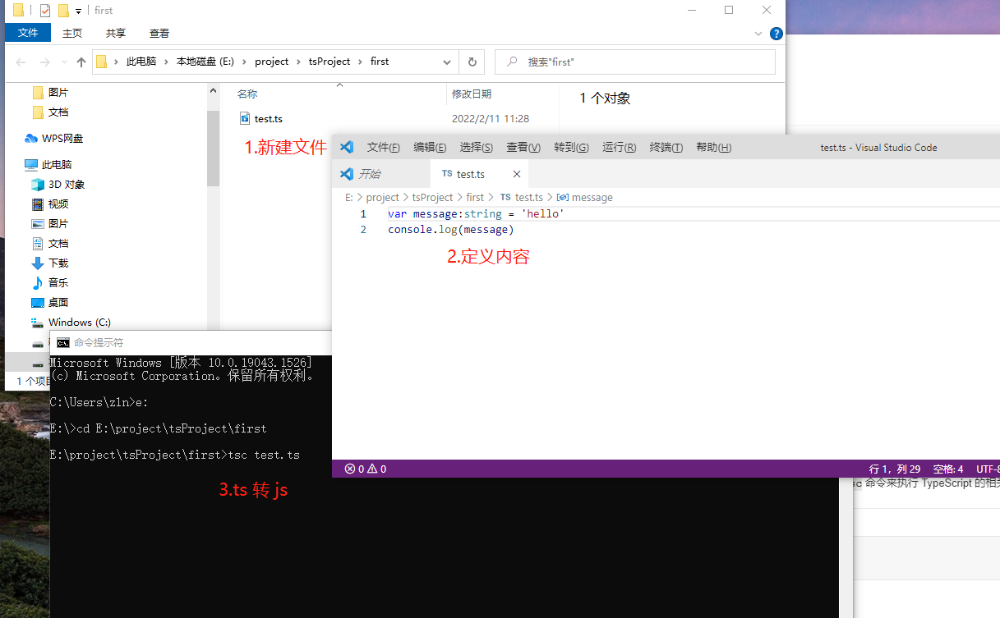
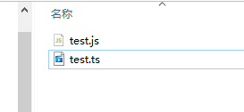

## 基本介绍

TypeScript简称TS，就像Less/Sass是对CSS进行扩展一样, TS也是对JS进行扩展

(TypeScript是JavaScript的超集，因为它扩展了JavaScript，有JavaScript没有的东西。)<br>
(硬要以父子类关系来说的话，TypeScript是JavaScript子类，继承的基础上去扩展。)

TypeScript 是添加了类型系统的 JavaScript，适用于任何规模的项目。<br>
类型系统按照「类型检查的时机」来分类，可以分为动态类型和静态类型： 
- **动态类型**: 是指在**运行时才会进行类型检查**，这种语言的类型错误往往会导致运行时错误，我们熟悉的 JavaScript 即属于动态类型，它是一门解释型语言，没有编译阶段。
- **静态类型**: 是指**编译阶段就能确定每个变量的类型**，这种语言的类型错误往往会导致语法错误。
由于 TypeScript 在运行前需要先编译JavaScript，而在编译阶段就会进行类型检查，
所以 ==TypeScript 属于 静态类型==。

## 新增功能

- 类型批注和编译时类型检查
- 类型推断
- 类型擦除
- 接口
- 枚举
- Mixin
- 泛型编程
- 名字空间
- 元组

## 基本概念

- 类（Class）：定义了一件事物的抽象特点，包含它的属性和方法
- 对象（Object）：类的实例，通过 new 生成
- 面向对象（OOP）：的三大特性：封装、继承、多态
- 封装（Encapsulation）：将对数据的操作细节隐藏起来，只暴露对外的接口。外界调用端不需要（也不可能）知道细节，就能通过对外提供的接口来访问该对象，同时也保证了外界无法任意更改对象内部的数据
- 继承（Inheritance）：子类继承父类，子类除了拥有父类的所有特性外，还有一些更具体的特性
- 多态（Polymorphism）：由继承而产生了相关的不同的类，对同一个方法可以有不同的响应。比如 Cat 和 Dog 都继承自 Animal，但是分别实现了自己的 eat 方法。此时针对某一个实例，我们无需了解它是 Cat 还是 Dog，就可以直接调用 eat 方法，程序会自动判断出来应该如何执行 eat
- 存取器（getter & setter）：用以改变属性的读取和赋值行为
- 修饰符（Modifiers）：修饰符是一些关键字，用于限定成员或类型的性质。比如 public 表示公有属性或方法
- 抽象类（Abstract Class）：抽象类是供其他类继承的基类，抽象类不允许被实例化。抽象类中的抽象方法必须在子类中被实现
- 接口（Interfaces）：不同类之间公有的属性或方法，可以抽象成一个接口。接口可以被类实现（implements）。一个类只能继承自另一个类，但是可以实现多个接口


## 优点
> 增加了代码的可读性和可维护性

- 类型系统实际上是最好的文档，大部分的函数看看类型的定义就可以知道如何使用了
- 可以在编译阶段就发现大部分错误，这总比在运行时候出错好
- 增强了编辑器和 IDE 的功能，包括代码补全、接口提示、跳转到定义、重构等

## 安装

> 保证电脑中已有npm，如果没有需要安装。

安装 typescript：
```ts
npm install -g typescript
cnpm install -g typescript
```
安装完成后我们可以使用 tsc 命令来执行 TypeScript 的相关代码，以下是查看版本号：

```ts 
$ tsc -v
Version 3.2.2
```
 

cmd回车后生成对应js文件
 

使用 node 命令来执行 test.js 文件：
```ts
$ node app.js 
hello
```

TypeScript 中，使用<font color="green">:</font> 指定变量的类型，<font color="green">: 的前后有没有空格都可以</font>。<br>
上述例子中，我们用中，使用<font color="green">: 指定 person 参数类型为 string</font> 。但是编译为 js 之后，并没有什么检查的代码被插入进来。<br>
TypeScript 编译的时候即使报错了，还是会生成编译结果，我们仍然可以使用这个编译之后的文件。<br>
如果要在报错的时候终止 js 文件的生成，可以在 tsconfig.json 中配置 noEmitOnError 即可。<br>

