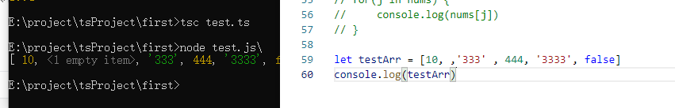

## 元组
我们知道数组中元素的数据类型都一般是相同的（any[] 类型的数组可以不同），如果存储的元素数据类型不同，则需要使用元组。<br>
元组中允许存储不同类型的元素，元组可以作为参数传递给函数。<br>
创建元组的语法格式如下：<br>
```ts
var tuple_name = [value1,value2,value3,…value n]
```
定义一对值分别为 string 和 number 的元组：
```ts
let tom: [string, number] = ['Tom', 25];
```

