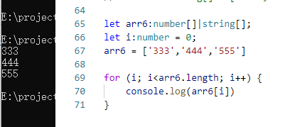

## 联合类型
联合类型（Union Types）可以通过管道(|)将变量设置多种类型，赋值时可以根据设置的类型来赋值。（取值可以为多种类型中的一种）<br>
注意：只能赋值指定的类型，如果赋值其它类型就会报错。<br>
创建联合类型的语法格式如下：<br>
```ts
Type1|Type2|Type3 
```


```ts
let myVal: string | number;
myVal = 'seven';
myVal = 7;
```