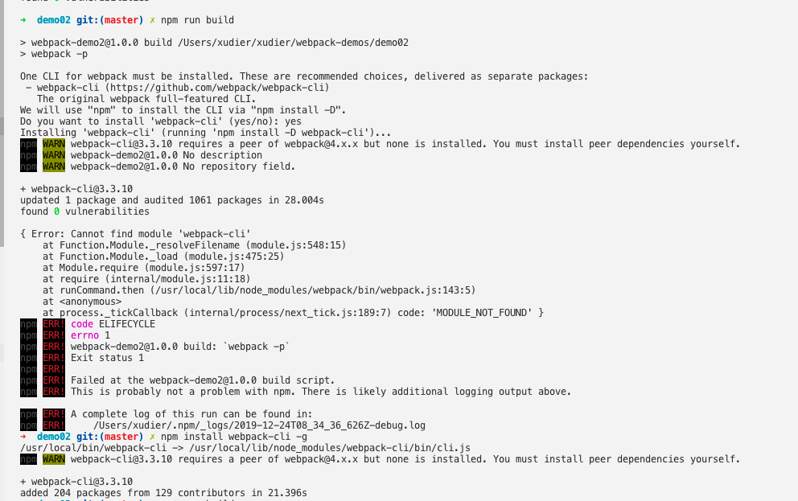
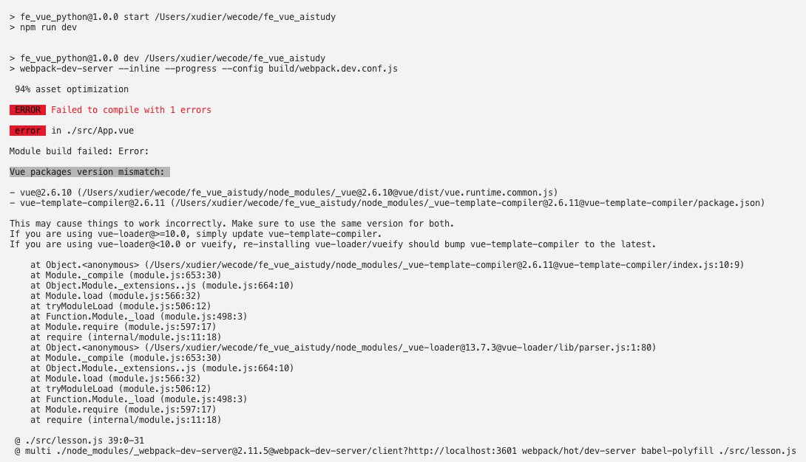

# webpack 学习之路遇到的问题

## 1.npm下载遇到问题（已查到解决方法，记录）
> 并非在学习webpack遇到的问题，正确意义上来讲，是刚踏上学习之路就被绊倒了。😢
~~~js
$ npm i -g webpack webpack-dev-server
~~~
在下载webpack的时候 npm报错，网上查说是需要重置npm相关文件夹的权限，并分配给当前用户 
尝试过前两个命令：

~~~js
sudo chown -R $(whoami) ~/.npm
sudo chown -R $(whoami) ~/.config
~~~
但是这个并不好使！他会提示我：

~~~js
chown: /Users/xudier/.npmm: No such file or directory
~~~
所以换了另一种方式：
~~~js
sudo chown -R $USER:$GROUP ~/.npm
sudo chown -R $USER:$GROUP ~/.config
~~~
结果很美好！顺利执行！ 

stackoverflow 中也有人遇到过相同的问题，他们对其解释为： 
问题描述：On npm install: Unhandled rejection Error: EACCES: permission denied（权限被拒绝） 
第一次运行NPM时使用sudo，例如在尝试执行npm install -g时，就会发生这种情况。 
缓存文件夹需要由当前用户拥有，而不是root。 
还值得注意的是，您不应该使用SUDO安装全局软件包。如果您确实遇到权限问题，则值得更改全局目录。该文档建议：

~~~js
mkdir ~/.npm-global
npm config set prefix '~/.npm-global'
// 然后在定义的任何地方更新PATH（〜/ .profile等）
export PATH=~/.npm-global/bin:$PATH
~~~
然后，您需要确保已设置PATH env变量（重新启动终端或使用source命令）

参考借鉴
+ [stackoverflow](https://stackoverflow.com/questions/50639690/on-npm-install-unhandled-rejection-error-eacces-permission-denied)
+ [全局安装软件包时解决EACCES权限错误](https://docs.npmjs.com/resolving-eacces-permissions-errors-when-installing-packages-globally)

## 2.Error: Cannot find module 'webpack-cli'问题
> 运行npm run build 的时候，提示这个问题

> 根据提示npm install webpack-cli -g，运行后可解决报错，但是会引出别的问题，说某个属性为undefined，解决方法为：
+ [报错TypeError: Cannot read property 'presetToOptions' of undefined的解决办法](https://www.cnblogs.com/zhahuhu/p/11780576.html)；
> 但是可能对我的来说并不好使，所以另一个方法是，先卸载：
~~~js
sudo npm uninstall webpack -g
sudo npm uninstall webpack -d
~~~
> 再重新安装一遍（全局）
~~~js
npm install webpack-cli -g
~~~
> 完美解决

## 3.移动端H5项目常见问题汇总及解决方案
> 参考借鉴
+ [移动端H5项目常见问题汇总及解决方案](https://www.jianshu.com/p/40e65ff355c5)

## 4.Vue packages version mismatch 问题

之前下载过一个项目并成功运行跑起来之后，就搁置了。后续同事接着开发，当我再接手时，经过npm i 下载，npm run start 启动时vue报错， 
 
借鉴 [【解决】Vue packages version mismatch](https://www.jianshu.com/p/4427489f7e4e) 这篇文章， 
不过，我并没有像文中所说：
> 如果你的vue-loader版本<10.0或者使用了vueify，需要重新安装vue-loader和vueify，然后更新vue-template-compiler到最新版本

这样重新安装，而是简单的删除node_modules包,重新加下载，问题解决。