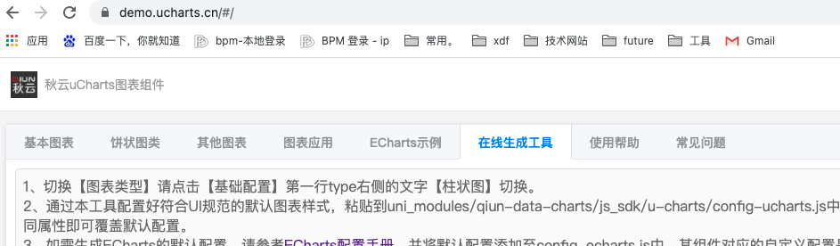
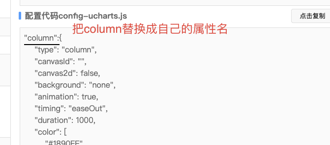
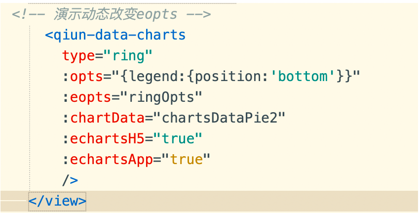
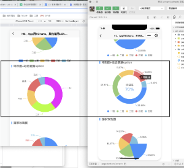
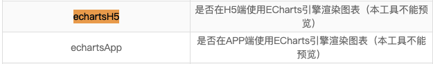

[插件市场](https://ext.dcloud.net.cn/plugin?id=271)

注意：
- [可以从插件市场里下载示例](https://demo.ucharts.cn/#/)
- 线上demo地址，有在线生成工具，基本配置可在页面上配好生成代码 (如下图)


- 右下角配置代码config-ucharts.js <br>
文档上说是改人家组建里的js文件，可是这样如果有一天别人替换了/升级了，是要主动备份的，这不太友好。<br>
所以建议在自己的组件里面，自行定义修改。<br>
最外层的对象属性名直接替换成自己定义的 用就行了 (如下图)


- uchart绑定的属性是opts， echarts绑定的属性eopts， 不要混用。

- 里面有一些属性其实是用不到的，可以自行删除

- 官网demo中有配置 有这两个【echartsH5="true"；:echartsApp="true"】 （如下图）


目测配置这两个属性后， 产生不同的效果（验证4）<br>


其中

```js
:opts 配置项
opts={
    legend:{
        position:'bottom'
    }
}
 
:eopts 配置项
ringOpts:{
    color:['#FF00FF','#AAFF11'],
    legend:{show:false}
},
```

- 猜想如果组件上不加属性 【:echartsH5="true"；:echartsApp="true"】并仔细理解下面

可以理解为：如果均不开启，那么多端用的全是ucharts，这也就代表不需要配置eopts
