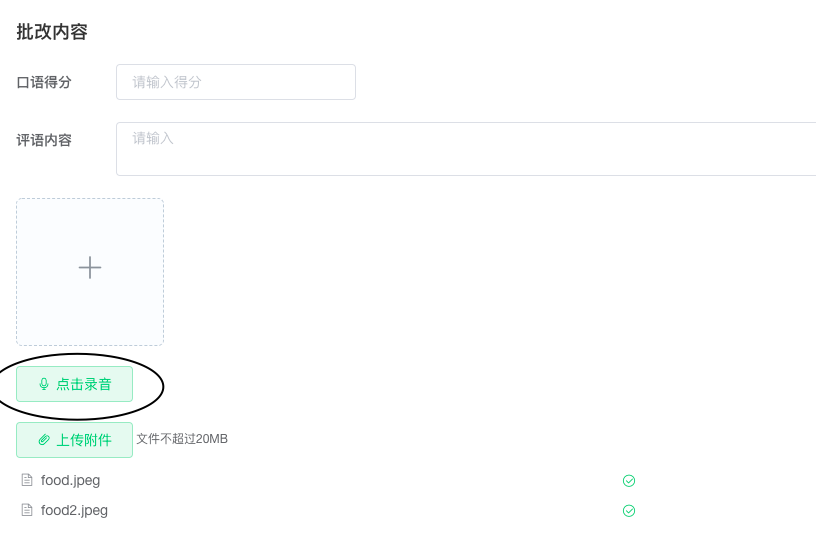
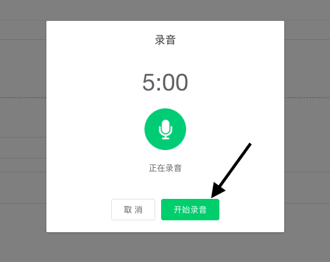
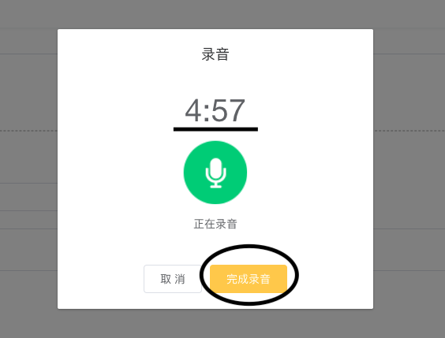
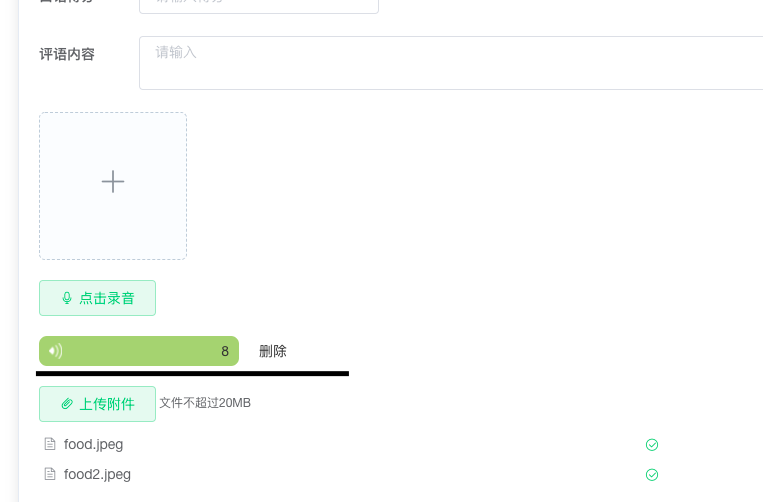

> 基于vue在PC端实现录音功能
> 需求背景：教师批改作业时，可在电脑上直接录音，发布后学生可以听到该录音。

# 实现效果图：

- 1.点击按钮

- 2.点击开始录音，倒计时开始。

- 3.录音中，倒计时开始，点击完成录音，结束录音生成录音条。

- 4.页面生成录音条，点击可听到刚刚的录音内容。


# 实现步骤

## 步骤一
准备文件，封装好方法js
第一个文件：hz-recorder-sdk.js
```js
//hz-recorder-sdk.js
import HZRecorder from "./hz-recorder"
export default class {
  startRecord (param) {
    console.log(new Date());
    let self = this;
    try {
      HZRecorder.get(rec => {
        if (rec.error) return param.error(rec.error);
        self.recorder = rec;

        self.recorder.start(param.obj, param.objwidth);
        param.success("开始录音");
      })
    } catch (e) {
      param.error("开始录音失败" + e);
    }
  }

  stopRecord (param) {
    let self = this;
    try {
      let blobData = self.recorder.getBlob();
      param.success(blobData);
    } catch (e) {
      param.error("结束录音失败" + e);
    }
  }

  play (audio) {
    let self = this;
    try {
      self.recorder.play(audio);
    } catch (e) {
      console.error("录音播放失败" + e);
    }
  }

  clear (audio) {
    let self = this;
    try {
        if(self.recorder) {
            self.recorder.clear(audio);
        }
    } catch (e) {
      console.error("清空录音失败" + e);
    }
  }

  getRecord (param) {
    let self = this;
    try {
      HZRecorder.get(rec => {
        if (rec.error) return param.error(rec.error);
        self.recorder = rec;
        self.recorder.start();
        param.success("开始录音");
      })
    } catch (e) {
      param.error("开始录音失败" + e);
    }
  }
}
```

## 步骤二

第二个js文件： hz-recorder.js
```js
export default class HZRecorder {
    constructor(stream, config) {
        //兼容
        window.URL = window.URL || window.webkitURL;
        navigator.getUserMedia = navigator.getUserMedia || navigator.webkitGetUserMedia || navigator.mozGetUserMedia || navigator.msGetUserMedia;

        this.context = new (window.webkitAudioContext || window.AudioContext);

        config = config || {};
        config.sampleBits = config.sampleBits || 8;      //采样数位 8, 16
        config.sampleRate = config.sampleRate || (this.context.sampleRate/6);   //在chrome和火狐浏览器下值不是44100,所以不能用44100/6  
        this.audioInput = this.context.createMediaStreamSource(stream);
        this.createScript = this.context.createScriptProcessor || this.context.createJavaScriptNode;
        this.recorder = this.createScript.apply(this.context, [4096, 1, 1]);

        this.audioData = {
            size: 0          //录音文件长度
            , buffer: []     //录音缓存
            , inputSampleRate: this.context.sampleRate    //输入采样率
            , inputSampleBits: 8       //输入采样数位 8, 16
            , outputSampleRate: config.sampleRate    //输出采样率
            , oututSampleBits: config.sampleBits       //输出采样数位 8, 16
            , input: function (data) {
                this.buffer.push(new Float32Array(data));
                this.size += data.length;
            }, 
            compress: function () { //合并压缩
                //合并
                let data = new Float32Array(this.size);
                let offset = 0;
                for (let i = 0; i < this.buffer.length; i++) {
                    data.set(this.buffer[i], offset);
                    offset += this.buffer[i].length;
                }
                //压缩
                let compression = parseInt(this.inputSampleRate / this.outputSampleRate);
                let length = data.length / compression;
                let result = new Float32Array(length);
                let index = 0, j = 0;
                while (index < length) {
                    result[index] = data[j];
                    j += compression;
                    index++;
                }
                return result;
            }, 
            encodeWAV: function () {
                let sampleRate = Math.min(this.inputSampleRate, this.outputSampleRate);
                let sampleBits = Math.min(this.inputSampleBits, this.oututSampleBits);
                let bytes = this.compress();
                let dataLength = bytes.length * (sampleBits / 8);
                let buffer = new ArrayBuffer(44 + dataLength);
                let data = new DataView(buffer);

                let channelCount = 1;//单声道
                let offset = 0;

                let writeString = function (str) {
                    for (let i = 0; i < str.length; i++) {
                        data.setUint8(offset + i, str.charCodeAt(i));
                    }
                }

                // 资源交换文件标识符 
                writeString('RIFF'); offset += 4;
                // 下个地址开始到文件尾总字节数,即文件大小-8 
                data.setUint32(offset, 36 + dataLength, true); offset += 4;
                // WAV文件标志
                writeString('WAVE'); offset += 4;
                // 波形格式标志 
                writeString('fmt '); offset += 4;
                // 过滤字节,一般为 0x10 = 16 
                data.setUint32(offset, 16, true); offset += 4;
                // 格式类别 (PCM形式采样数据) 
                data.setUint16(offset, 1, true); offset += 2;
                // 通道数 
                data.setUint16(offset, channelCount, true); offset += 2;
                // 采样率,每秒样本数,表示每个通道的播放速度 
                data.setUint32(offset, sampleRate, true); offset += 4;
                // 波形数据传输率 (每秒平均字节数) 单声道×每秒数据位数×每样本数据位/8 
                data.setUint32(offset, channelCount * sampleRate * (sampleBits / 8), true); offset += 4;
                // 快数据调整数 采样一次占用字节数 单声道×每样本的数据位数/8 
                data.setUint16(offset, channelCount * (sampleBits / 8), true); offset += 2;
                // 每样本数据位数 
                data.setUint16(offset, sampleBits, true); offset += 2;
                // 数据标识符 
                writeString('data'); offset += 4;
                // 采样数据总数,即数据总大小-44 
                data.setUint32(offset, dataLength, true); offset += 4;
                // 写入采样数据 
                if (sampleBits === 8) {
                    for (let i = 0; i < bytes.length; i++, offset++) {
                        let s = Math.max(-1, Math.min(1, bytes[i]));
                        let val = s < 0 ? s * 0x8000 : s * 0x7FFF;
                        val = parseInt(255 / (65535 / (val + 32768)));
                        data.setInt8(offset, val, true);
                    }
                } else {
                    for (let i = 0; i < bytes.length; i++, offset += 2) {
                        let s = Math.max(-1, Math.min(1, bytes[i]));
                        data.setInt16(offset, s < 0 ? s * 0x8000 : s * 0x7FFF, true);
                    }
                }
                return new Blob([data], { type: 'audio/mp3' })
                // return new Blob([data], { type: 'audio/wav' });
            },
            closeContext:function(){
                if(this.context) {
                    this.context.close();
                }
            }
        }
    }

    //开始录音
    start (obj, width) {
        this.audioInput.connect(this.recorder);
        this.recorder.connect(this.context.destination);

        //音频采集
        let self = this;
        this.recorder.onaudioprocess = function (e) {
            self.audioData.input(e.inputBuffer.getChannelData(0));
            if(obj && width) {                
                let input = e.inputBuffer.getChannelData(0);
                let changeWidth = width/2*Math.max.apply(null,input);
                obj.style.width = changeWidth*1.3 + 'px';
            }
        }
    }

    //停止
    stop () {
        this.recorder.disconnect();
    }
    
    close () {
        if(this.audioData) {
            console.log(this.audioData)
            this.audioData.closeContext();
        }
    }

    //获取音频文件
    getBlob () {
        this.stop();
        return this.audioData.encodeWAV();
    }

    //回放
    play (audio) {
        let b = this.getBlob();
        audio.src = window.URL.createObjectURL(b);
    }
  
    //清理缓存的录音数据
    clear (audio) {
        this.audioData.buffer = [];
        this.audioData.size = 0;
        audio.src = ''
    }
    
    //停止播放
    stopPlay (audio){
        audio.pause();
    }

    // //上传
    // upload (url,pdata, callback) {
    //     let fd = new FormData();  
    //     fd.append('file', this.getBlob());  
    //     let xhr = new XMLHttpRequest();
    //     for (let e in pdata)
    //             fd.append(e, pdata[e]);  
    //     if (callback) {  
    //         xhr.upload.addEventListener('progress', function (e) {  
    //             callback('uploading', e);  
    //         }, false);  
    //         xhr.addEventListener('load', function (e) {  
    //             callback('ok', e);  
    //         }, false);  
    //         xhr.addEventListener('error', function (e) {  
    //             callback('error', e);  
    //         }, false);  
    //         xhr.addEventListener('abort', function (e) {  
    //             callback('cancel', e);  
    //         }, false);  
    //     }  
    //     xhr.open('POST', url);  
    //     xhr.send(fd);  
    // } 

    static checkError (e) {
        const { name } = e;
        let errorMsg = ''
        switch (name) {
            case 'AbortError': errorMsg = '录音设备无法被使用'; break;
            case 'NotAllowedError': errorMsg = '用户已禁止网页调用录音设备'; break;
            case 'PermissionDeniedError': errorMsg = '用户已禁止网页调用录音设备'; break;     // 用户拒绝
            case 'NotFoundError': errorMsg = '录音设备未找到'; break;
            case 'DevicesNotFoundError': errorMsg = '录音设备未找到'; break;
            case 'NotReadableError': errorMsg = '录音设备无法使用'; break;
            case 'NotSupportedError': errorMsg = '不支持录音功能'; break;
            case 'MandatoryUnsatisfiedError': errorMsg = '无法发现指定的硬件设备'; break;
            default: errorMsg = '录音调用错误'; break;
        }
        return { error: errorMsg }
    };
    
    static get (callback, config) {
        if (callback) {
            if (navigator.mediaDevices && navigator.mediaDevices.getUserMedia) {
                navigator.mediaDevices.getUserMedia({ audio: true, video: false }).then((stream) => {
                    let rec = new HZRecorder(stream, config);
                    callback(rec);
                }).catch((e) => {
                    callback(HZRecorder.checkError(e));
                })
            } else {
                navigator.getUserMedia({ audio: true, video: false }).then((stream) => {
                    let rec = new HZRecorder(stream, config);
                    callback(rec);
                }).catch((e) => {
                    // HZRecorder.checkError(e)
                    callback(HZRecorder.checkError(e));
                })
            }
        }
    }
}

```
## 步骤三

封装好的 vue文件 :record.vue
我的实践项目时给予 vue+element-ui实现的，所以这里有用到element的弹框组件

```vue
<template>
  <div class="layouts-recorder">
      <el-dialog
        title="录音"
        :show-close="false"
        :close-on-click-modal="false"
        :close-on-press-escape="false"
        :visible.sync="isShowRecord"
        width="400px"
        center
        :before-close="handleClose">
        <div class="recordCont">
            <p class="recordTime">{{showTime}}</p>
            <div class="recordImg">
                
            </div>
            <p class="recordTip">正在录音</p>
        </div>
        <span slot="footer" class="dialog-footer">
            <el-button @click="cancelRecord">取 消</el-button>
            <el-button v-if="isNotRecord" type="success" @click="beginOrStopRecorder">开始录音</el-button>
            <el-button v-else type="warning" @click="handleStopRecord">完成录音</el-button>
        </span>
    </el-dialog>
  </div>
</template>
<script>
import Record from "@/assets/js/hz-recorder-sdk.js";

export default {
    props:{
        isShowRecord : {
            type: Boolean,
            default: false
        },
    },
    data() {
        return {
            startTime: "", // 语音开始时间
            endTime: "", // 语音结束
            recorderTime: 0, // 录音时间
            dialogVisible: false,
            recorder: null,
            recordUrl: '',
            maxTime: 300, // 时间倒计时
            showTime: '5:00',
            allTimer: null, 
            isNotRecord: true, //当前 未开始 录音
        };
    },
    mounted() {
        this.init();
    },
    methods: {
        init() {
            this.recorder = new Record()
        },
        beginOrStopRecorder() {
            if (!this.allTimer) {
                this.recorder.startRecord({
                    success: res => {                    
                        this.coutdown();
                        this.allTimer = setInterval(this.coutdown, 1000);
                        this.startTime = new Date().getTime()
                        this.isNotRecord = false;
                    },
                    error: e => {
                        console.log(e)
                    }
                });
            }
        },
        coutdown() {
            if (this.maxTime >= 0) {
                let minutes = Math.floor(this.maxTime / 60);
                let seconds = Math.floor(this.maxTime % 60);
                this.showTime = minutes + ":" + (seconds >= 10 ? seconds : "0" + seconds);
                --this.maxTime;
            } else {
                this.handleStopRecord();
                this.resitCoutdown();
            }
            console.log("倒计时中")
        },
        resitCoutdown() {
            clearInterval(this.allTimer);
            this.allTimer = null;
            this.maxTime = 300;
        },
        cancelRecord() {
            this.handleClose(null)
        },
        // 停止录音的方法
        handleStopRecord() {
            this.endTime = new Date().getTime();
            this.recorderTime = Math.round((this.endTime -this.startTime)/1000);
            if(this.recorderTime<1){
                console.log('录音时间过短，请重新录入');
                return ;
            }
            this.recorder.stopRecord({
                success: res => {
                    let curVideoObj = {
                        resBlob : res,//此处可以获取音频源文件(res)
                        url: URL.createObjectURL(res),
                        videoTime: this.recorderTime
                    }
                    this.handleClose(curVideoObj)
                    this.resitCoutdown();
                },
                error: e => {
                    console.log(e)
                }
            });
        },
        handleClose(videoObj) {
            this.$emit('closeRecord' , videoObj)
        },
    },
};
</script>

<style lang="scss">
p{
    margin: 0;
}
.recordCont{
    min-height: 180px;
    .recordTime{
        font-size: 40px;
        text-align: center;
        font-size: #333;
    }
    .recordImg{
        margin-top: 20px;
        display: flex;
        justify-content: center;
        .recordPic{
            display: inline-block;
            width: 70px;
        }
    }
    .recordTip{
        text-align: center;
        margin-top: 20px;
    }
    .star1 {
        animation: star1_rotate 1.5s linear infinite;
    }
}
// 一闪一闪亮晶晶
@keyframes star1_rotate{
    0%{
        transform: scale(1)
    }
    50%{
        transform: scale(1.2)
    }
    100%{
        transform: scale(1)
    }
}
</style>
```

## 步骤四

在父组件中正常引入该组件，即可。以及必要的 属性 及 方法。

```vue
<template>
    <div class="uploadPart">
        // 点击录音按钮
        <el-button icon="el-icon-microphone" plain type="success" @click="openRecordDia">点击录音</el-button> 
        // 录音内容展示条
        <div class="mp3List">
            <div class="mp3Item" v-for="(item, index) in recordList" :key="index">
                <div class="mp3Bar" @click="playAudio(item)">
                    
                    <p class="mp3Time">{{item.time}}</p>
                </div>
                <div class="delBtn" @click="delRecord(index)">删除</div>
            </div>
        </div>

        // 封装好的录音组件
        <record
            v-if="isShowRecord"
            :isShowRecord="isShowRecord" 
            @closeRecord="closeRecord"/>

        // 页面中播放录音的 video
        <video ref="recordPlayer" style="display: none"></video>
    </div>
</template>

<script>
import record from "@/views/correctMenu/components/record"

export default{
    data() {
        return{
            isShowRecord: false,
            recordList: [],
        }
    },
    methods:{
        closeRecord(obj){ // 关闭弹框，并记录由组件传来的内容。
            this.isShowRecord = false;
            if (obj) {
                this.recordList.push({
                    url: obj.url,
                    time: obj.videoTime,
                    videoBlob: obj.resBlob
                })
            }
        },
        openRecordDia() { // 打开弹框
            this.isShowRecord = true;
        },
        playAudio(obj) { // 播放该录音
            if (obj) {
                this.$refs.recordPlayer.src = obj.url
                this.$refs.recordPlayer.play()
            }
        },
    }

}
</script>

<style>
.mp3List{
    width: 50%;
    margin-bottom: 20px;
    .mp3Item{
        margin-bottom: 10px;
        display: flex;
        align-items: center;
        .mp3Bar{
            cursor: pointer;
            width: 200px;
            height: 30px;
            border-radius: 8px;
            background: rgba(112, 182, 3, 0.6);
            display: flex;
            justify-content: space-between;
            align-items: center;
            padding: 0 10px;
            .playIcon{
                width: 13px;
                display: inline-block;
            }
            .mp3Time{
                color: #333;
                font-size: 14px;
            }
        }
        .delBtn{
            color: #333;
            font-size: 14px;
            margin-left: 20px;
            cursor: pointer;
        }
        &:last-child{
            margin-bottom: 0;;
        }
    }
}
</style>
```