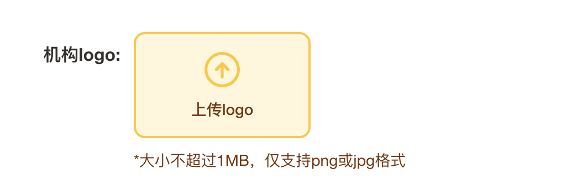
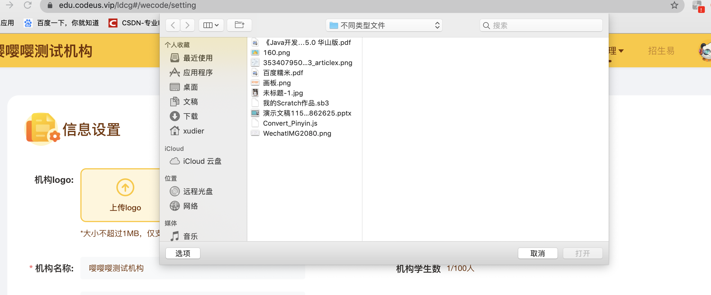
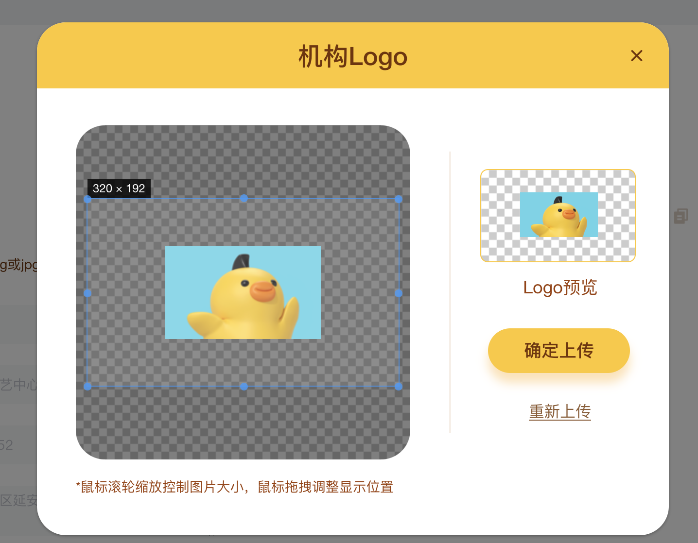

> 向原作者致敬 附上链接 https://github.com/xyxiao001/vue-cropper

目标效果：<br>
- 点击上传logo<br>
<br>

- 弹出文件选择框，选择文件后<br>
<br>

- 显示图片裁剪弹框<br>
<br>
如图所示，这是目前实现的效果。<br>

说明：<br>
图片上传采用了element-ui的组件upload，图片裁剪用的cropper，两者相结合，最终实现效果。

安装
```js
cnpm install vue-cropper --save
// 开始因为没有加 --save， 导致package.json中没有它，打包失败。
```

使用
```js
// main.js里面使用
import VueCropper from 'vue-cropper'
Vue.use(VueCropper)
```

组件内使用
```js
import { VueCropper } from 'vue-cropper'
components: {
  VueCropper
}
```

值得注意：<br>
1.需要使用外层容器包裹并设置宽高。<br>
2.按照规定方式定义option<br>

附上代码：<br>

```html
<!-- 裁剪框 -->
<div class="leftImg">
  <VueCropper
    ref="cropper"
    centerBox
    :img="option.img"
    :outputSize="option.size"
    :outputType="option.outputType"
    :info="true"
    :full="option.full"
    :canMove="option.canMove"
    :canMoveBox="option.canMoveBox"
    :original="option.original"
    :autoCrop="option.autoCrop"
    :autoCropWidth="option.autoCropWidth"
    :autoCropHeight="option.autoCropHeight"
    :fixedBox="option.fixedBox"
    :fixedNumber="option.fixedNumber"
    :fixed="option.fixed"
    @realTime="realTime"
  />
</div>
<!-- 实时预览 -->
<div class="show-preview">
  <div class="preview"
      :style="{
        'width': previews.w + 'px !important',
        'height': previews.h + 'px',
        'transform':`scale(calc(160 / ${previews.w}),calc(92 / ${previews.h}))`,
        'top': viewPosition,
        'left': viewPosition
      }"
      style="transform-origin:0 0"
    >
    
  </div>
</div>
```
```js
data() {
  return {
    previews: {},
    viewPosition: '0px',
    option: {
      img: '',
      outputSize:1, //剪切后的图片质量（0.1-1）
      size: 1,
      full: false, // 输出原图比例截图 props名full
      outputType: 'png',
      canMove: true,
      original: false,
      canMoveBox: true,
      autoCrop: true,
      autoCropWidth: 320,
      autoCropHeight: 192,
      fixedBox: false,
      fixedNumber: [5, 3],
      centerBox: true,
      fixed: true,
    },
  }
},
methods:{
  // 实时预览函数
  realTime(data) {
    this.previews = data;
  },
  //  确定裁剪输出的区域
  handleImg() {
    this.$refs.cropper.getCropData((data) => {
      let newFile = this.convertBase64UrlToBlob(data); // 将base64格式转为blob 可以通过formdata传给后台的文件格式 
      this.$emit('handleClose', 'reUpload', newFile);
    })
  },
  convertBase64UrlToBlob(dataurl, filename = 'file') {
    let arr = dataurl.split(',')
    let mime = arr[0].match(/:(.*?);/)[1]
    let suffix = mime.split('/')[1]
    let bstr = atob(arr[1])
    let n = bstr.length
    let u8arr = new Uint8Array(n)
    while (n--) {
      u8arr[n] = bstr.charCodeAt(n)
    }
    return new File([u8arr], `${filename}.${suffix}`, {
      type: mime
    })
  }
}
```