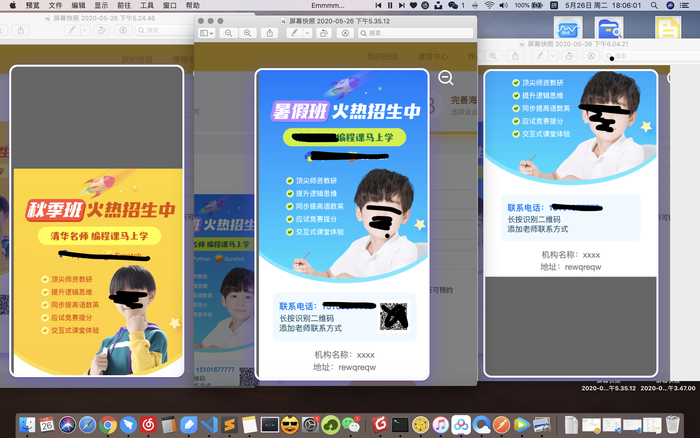
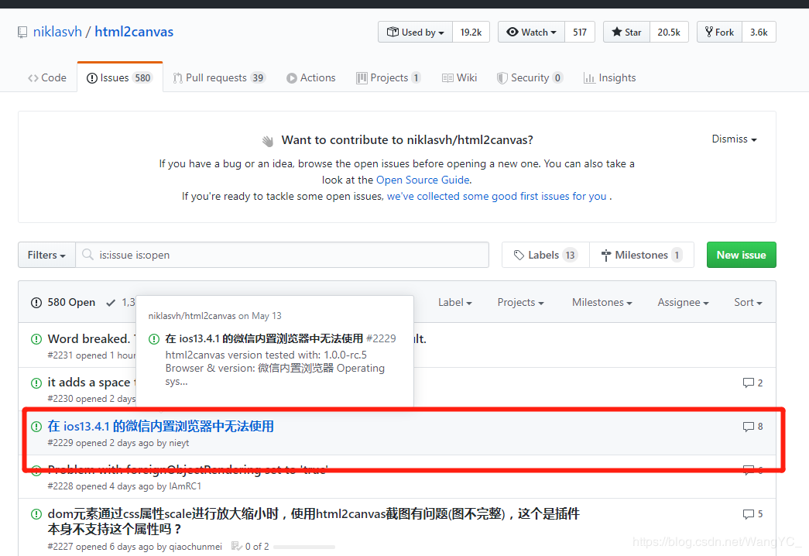

> 向作者致敬,附上官网地址 http://html2canvas.hertzen.com/

安装
```js
cnpm install --save html2canvas // 有条件的就用cnpm，我用npm反正没有下下来
```

使用
```js
import html2canvas from 'html2canvas'; // 在需要用的组件中 定义
```

html
```html
<div id="capture" style="padding: 10px; background: #f5da55">
    <h4 style="color: #000; ">Hello world!</h4>
</div>
<!-- 或者 封装成一个组件 关键的是那个id -->
<LeftModel
  id="imagePart"
  symbol="fixed"
  :organLogoBase64="organLogoBase64"
  :modelObj="modelObj"
  :curMode="curMode"
  :posterQrCodeUrl="posterQrCodeUrl"
  :pageData="pageData"/>
```

```js
methods: {
  //点击生成图片
  generatorImage() { // 最好在调用方法是延迟一点，不然有时候图片会加载不全
    let timer = setTimeout(() => {
      clearTimeout(timer);
      this.htmlPhoto('preview');
    }, 1000)
  },
  htmlPhoto() {
    const div = document.getElementById('imagePart');
    html2canvas(div,{
      backgroundColor: null,
      backgroundPositionX: '0px;',
      backgroundPositionY: '0px',
      scale: 4, // 设置这个解决了生成图片模糊问题
      scrollY: 0,
      useCORS:true,
    }).then((canvas) => {
      let imgUrl = canvas.toDataURL("image/png");
      // todo
    });
  },
}
```

coding中遇到的问题：<br>
1.元素中有图片用到了非本地的会有跨域问题，两种解决方式<br>
  - 1.在跨域的图片里设置 crossOrigin="anonymous" 并且需要给imgUrl加上随机数<br>
  - 2.将跨域图片转为base64格式（本次应用逻辑是后台将图片转为base64发给了前端）<br>

2.类似于图片中<br>

- 1.最左边这个情况一般发生在，页面有竖向滚动条时，当页面发生了滚动，他就有一部分图片消失了
- 2.中间这个情况是在滚动条没有动的初始状态下，会向右偏移

统一解决的思路是，在html代码中复制了一模一样的，因为我是包装成了组件，所以只是将组件再复制了一份。<br>
不同的是，另一份，是通过position:fixed 国定在视口中，并将z-index设置为-1,<br>
这样不管你屏幕怎么滚动，他都始终在这里。只是属于比较笨的方法，因为写了重复代码<br>
在没有找到新的解决思路之前，可能会保持这个状态<br>

## 开发过程中遇到这样一个问题
### <b>html2canvas 在ios13.4.1系统中不生效</b><br>

问题描述：最近在开发 html2canvas 的时候，突然发现，html2canvas在IOS13.4.1系统中调用失败。后马上去github上查看是否有同道中人遇到类似问题。



解决方案：<br>

- 1.首先将 package.json 中的 html2canvas 版本降低为【1.0.0-rc.4】<br>
  版本降低方法<br>
  首先移除 html2canvas 【npm uninstall html2canvas】<br>
  然后安装指定版本 【npm install --save html2canvas@1.0.0-rc.4】<br>
  > npm不好使的时候可以用cnpm

- 2.上述操作不能解决问题时，采用第二步

```js
toHtmlCanvasShareFn() {
	// 修改前代码
	html2canvas(this.$refs.htmlCanvas, {
		backgroundColor: null
	}).then((canvas) => {
		let dataURL = canvas.toDataURL("image/png");
		this.shareImgUrl = dataURL;
		console.log(this.dataURL)
	});

	// 修改后代码 主要将 html2canvas 修改为 (window.html2canvas || html2canvas)
	(window.html2canvas || html2canvas)(this.$refs.htmlCanvas, {
		backgroundColor: null
	}).then((canvas) => {
		let dataURL = canvas.toDataURL("image/png");
		this.shareImgUrl = dataURL;
		console.log(this.dataURL)
	});
}
```

- 3.前两步都不好使的时候，尝试第三步

1.我做功能的时候，前两步都没有解决我的问题。<br>
于是我尝试这样首先移除【npm uninstall html2canvas】这个包<br>
2.把第二步中的兼容代码也加上<br>
3.在公共static文件中单独下载 html2canvas@1.0.0-rc.4这个版本<br>
4.记住要把在文件中用的 import html2canvas from 'html2canvas'; 这句删掉<br>
5.提测，顺利解决
