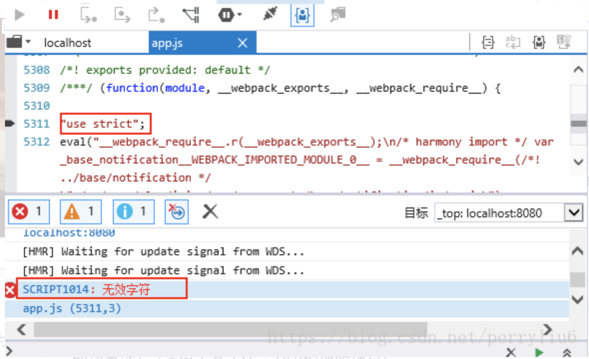

# 与vue有关的日子

## 问题

### 1.vue项目兼容IE浏览器
<br>
官方意思：vue项目可以在ie8以上的ie版本中运行，<br>
事实上vue-cli构建的项目并不能在ie8【ie9,ie10,ie11】以上的版本中运行<br>
下面就来讲vue如何在ie8以上ie版本中运行

#### （1）针对vue-cli 3.几版本 兼容问题

- 安装babel-polyfill
```js
npm install babel-polyfill --save
```
- 修改 vue.config.js webpack 配置
```js
chainWebpack: config => {
  config.entry('main').add('babel-polyfill') // main是入口js文件
}
```
- 重启
> 如果还没有解决问题，在入口文件main.js，可能在你的项目中是index.js中引入babel-polyfill
```js
import 'babel-polyfill';
```
#### （2）报错只能引用一个babel-polyfill
- 报错:Uncaught Error: only one instance of babel-polyfill is allowed<br>
- 解决方法:<br>
项目中只能引入一次babel-polyfill,我在main.js和vue.config.js中都引入了，<br>
删除main.js中的相关代码后,可以正常运行了.<br>

#### （3）使用iview按需引入时 IE下提示无效字符
ie报错:SCRIPT1014无效字符和SCRIPT5022<br>

不使用iView提供的项目构建程序 使用Vue-Cli3构建项目 采用按需引入的方式使用iView<br>
在IE中运行 会报如下错误 win10 IE11都不行 如下图：<br>
<br>
> 解决办法： (适用于基于Vue-Cli3构建的项目)

```js
// 在项目根目录创建vue.config.js 写入如下配置
module.exports = {
  chainWebpack:  config => {
    // ie报错无效字符 添加该配置项 解决该问题
    config.module
      .rule('iview')
      .test(/iview.src.*?js$/)
      .use('babel')
        .loader('babel-loader')
        .end()
  }
}
```
读不懂可以去 [webpack-chain](https://github.com/neutrinojs/webpack-chain) 查阅该插件文档

#### （4）针对vue-cli 2.几版本 兼容问题
按照步骤新建一个vue项目做测试
[vue2.0项目搭建步骤](https://blog.csdn.net/James_liPeng/article/details/85329677) 查阅该插件文档
- 1.安装 babel-polyfill
```js
cnpm install babel-polyfill --save-dev
```
- 2.在项目入口文件，如本项目中的main.js文件中 引用babel-polyfill
```js
import 'babel-polyfill'
```
- 3.修改webpack配置文件
```js
module.exports = {
  entry: {
    app: ['babel-polyfill', './src/main.js']
  },
  ...
}
// 到此 编译项目npm run build之后 该项目就可以成功在ie8以上的浏览器中打开了
// flex布局不兼容ie9及其一下
```

#### （5）安装babel-polyfill，打开IE依旧空白一片
有可能是因为static下的js文件中用了ES6语法，但是默认没有配置的babel-loader来处理static下的文件，所以导致IE前端报错，页面无法加载。<br>
[安装babel-polyfill，打开IE依旧空白解决方案](https://github.com/neutrinojs/webpack-chain) 查阅该文档

#### （6）Vue项目 IE/360浏览器兼容模式下打开空白的问题
[解决方案](https://juejin.im/post/5cad8c5ef265da0371298361) 查阅该文档

#### （7）vue-cli3.0和2.0的区别
[解决方案](https://juejin.im/post/5cad8c5ef265da0371298361) 查阅该文档